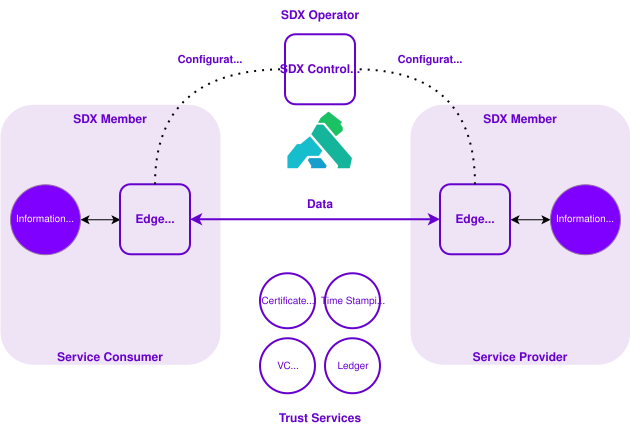

# Provider Journey Master Documentation

> Generated proof-of-concept output. Review before use or publication.

## Contents

- [Connected Services - Getting Started](#source-connected-services-getting-started)
    - [Connected Services overview](#connected-services-getting-started-docsindex)
    - [Purpose and value](#connected-services-getting-started-docspurpose-and-value)
    - [Connected services building blocks](#connected-services-getting-started-docsbuilding-blocks)
    - [Authoritative Data Register (ADR)](#connected-services-getting-started-docsauthoritative-data-register)
    - [Eligibility Factor Verification (EFV)](#connected-services-getting-started-docseligibility-factor-verification)
    - [Secure Data Exchange (SDX)](#connected-services-getting-started-docssecure-data-exchange)
    - [Privacy and security](#connected-services-getting-started-docsprivacy-and-security)
    - [Governance and policy](#connected-services-getting-started-docsgovernance-and-policy)
    - [Roles and responsibilities](#connected-services-getting-started-docsroles-and-responsibilities)
    - [Limits and constraints](#connected-services-getting-started-docslimits-and-constraints)
    - [Support](#connected-services-getting-started-docssupport)
- [APS Infrastructure Platform - SDX Documentation](#source-aps-infra-platform-sdx)
    - [Get Support](#aps-infra-platform-sdx-documentationhow-toget-support)
    - [Onboarding an Organization](#aps-infra-platform-sdx-documentationhow-tosdx-org-onboarding)
    - [Install an Edge Runtime Group](#aps-infra-platform-sdx-documentationhow-tosdx-edge-runtime-groups)
    - [Setup Organization Signing](#aps-infra-platform-sdx-documentationhow-tosdx-org-signing)
    - [Managing Subsystems](#aps-infra-platform-sdx-documentationhow-tosdx-subsystems)
    - [Managing Services](#aps-infra-platform-sdx-documentationhow-tosdx-services)
    - [Connecting a Service](#aps-infra-platform-sdx-documentationhow-tosdx-connections)
    - [Connection Resources](#aps-infra-platform-sdx-documentationhow-tosdx-connection-resources)
    - [Secure Data Exchange (SDX)](#aps-infra-platform-sdx-documentationconceptssecure-data-exchange)
    - [Restish CLI](#aps-infra-platform-sdx-documentationreferencerestish-cli)
    - [SDX Data Access Protocol](#aps-infra-platform-sdx-documentationreferencesdxdata-access-protocol)
    - [SDX Environments](#aps-infra-platform-sdx-documentationreferencesdxenvironments)
    - [Event Management](#aps-infra-platform-sdx-documentationhow-tosdx-ape-event-mgmt)
    - [Policy Management](#aps-infra-platform-sdx-documentationhow-tosdx-ape-policy-mgmt)
- [Eligibility Factor Verification TechDoc](#source-efv-techdoc)
    - [Introduction](#efv-techdoc-efv-techdoc-v3)
    - [Getting Started](#efv-techdoc-efv-techdoc-v3--getting-started)
    - [Eligibility factors](#efv-techdoc-efv-techdoc-v3--eligibility-factors)
    - [Income Verification](#efv-techdoc-efv-techdoc-v3--income-verification)
    - [Support and Next Steps](#efv-techdoc-efv-techdoc-v3--support-and-next-steps)

# Connected Services - Getting Started {#source-connected-services-getting-started}

<!-- source: https://github.com/bcgov/connected-services-techdocs.git@50959b28d410f638f0bccdd48f49c35f4179c24e:getting-started/docs/index.md -->

## Connected Services overview {#connected-services-getting-started-docsindex}


_Connected Services_ provides reusable building blocks that help government programs securely share and reuse trusted data. 

If you are building or managing a digital service, explore available APIs and datasets below, or learn more about Connected Services and its building blocks.

### Find APIs and datasets {#connected-services-getting-started-docsindex--find-apis-and-datasets}

Use DevHub search or explore the catalogues to discover: 

- [APIs that use _Secure Data Exchange_ (SDX)](https://developer.gov.bc.ca/catalogue?filters%5Bkind%5D=api&filters%5Btags%5D=secure-data-exchange)
- [_Authoritative Data_ sources](https://developer.gov.bc.ca/catalogue?filters%5Bkind%5D=api&filters%5Btags%5D=authoritative-data-register)
- [Available _Eligibility Factor Verification_ (EFVs)](https://developer.gov.bc.ca/catalogue?filters%5Bkind%5D=api&filters%5Btags%5D=eligibility-factor-verification)

### Availability {#connected-services-getting-started-docsindex--availability}

Connected Services capabilities are introduced iteratively. New APIs, datasets, and components will be added over time. 

### Learn more {#connected-services-getting-started-docsindex--learn-more}

To understand the broader purpose behind these capabilities, review [Purpose and value](#connected-services-getting-started-docspurpose-and-value). 

To understand how Connected Services components fit together, review [Connected Services building blocks](#connected-services-getting-started-docsbuilding-blocks). 

<!-- source: https://github.com/bcgov/connected-services-techdocs.git@50959b28d410f638f0bccdd48f49c35f4179c24e:getting-started/docs/purpose-and-value.md -->

## Purpose and value {#connected-services-getting-started-docspurpose-and-value}


Government programs often need information that already exists in another ministry or system. 

Today, this can result in delays, duplicate integrations, repeated data collection, inconsistent definitions, and manual verification processes. 

_Connected Services_ aims to improve service delivery by reducing duplication, supporting secure reuse of trusted data across government, and strengthening interoperability across ministries. 

It does this by establishing common building blocks that enable:

- [Access to authoritative data](#connected-services-getting-started-docsauthoritative-data-register)
- [Reusable eligibility checks](https://developer.gov.bc.ca/catalogue?filters%5Bkind%5D=api&filters%5Btags%5D=eligibility-factor-verification)
- [Secure, policy-aligned data exchange](#connected-services-getting-started-docssecure-data-exchange)
- [Centralized discovery of APIs and datasets](https://developer.gov.bc.ca/catalogue?filters%5Bkind%5D=api&filters%5Btags%5D=authoritative-data)

As these capabilities become available, teams will be able to use (and reuse) standardized components instead of building one-off integrations. 

### What this means for you {#connected-services-getting-started-docspurpose-and-value--what-this-means-for-you}

For developers, Connected Services supports: 

- Faster integrations with reusable components 
- Reduced custom validation logic 
- Access to governed and trusted data sources 
- Consistent integration guidance and sandbox environments 

For product owners and program leads, Connected Services supports: 

- Clear data ownership and accountability 
- Reduced duplication of datasets 
- More consistent eligibility decisions 
- Scalable cross-ministry service design 

For data custodians, data managers, and data providers, Connected Services supports: 

- Clear designation of authoritative data 
- Defined access and reuse policies 
- Reduced ad hoc data-sharing requests 
- Improved visibility into how data is used 
- Structured governance processes for oversight and accountability 

Connected Services establishes common foundations that support more consistent, secure, and interoperable digital services across government. 

Capabilities are being introduced iteratively. Availability of specific components will expand over time. 

### Explore the components {#connected-services-getting-started-docspurpose-and-value--explore-the-components}

Connected Services is delivered through reusable building blocks. 

To see how these components work together, review [Connected Services building blocks](#connected-services-getting-started-docsbuilding-blocks). 

<!-- source: https://github.com/bcgov/connected-services-techdocs.git@50959b28d410f638f0bccdd48f49c35f4179c24e:getting-started/docs/building-blocks.md -->

## Connected services building blocks {#connected-services-getting-started-docsbuilding-blocks}


_Connected Services_ is made up of reusable building blocks that work together to support secure, consistent data reuse across government. 

Each building block has a specific role. Together, they reduce duplicate integrations, improve data trust, and support more seamless service delivery. 

### Authoritative Data Register (ADR) {#connected-services-getting-started-docsbuilding-blocks--authoritative-data-register-adr}

_Authoritative Data_ is the official source of truth for specific information, such as residency, enrollment, property ownership, or program status. 

It provides trusted, governed data that other programs can rely on. 

[Learn more about ADR](#connected-services-getting-started-docsauthoritative-data-register). 

### Eligibility Factor Verification (EFV) {#connected-services-getting-started-docsbuilding-blocks--eligibility-factor-verification-efv}

_Eligibility Factor Verification_ (EFV) checks whether the details an applicant provides meet the rules for a particular government program. 

For example: 

- Is this person a BC resident? Yes/no 
- Is this individual enrolled in a specific program? Yes/no 

EFVs reduce manual verification and help standardize eligibility checks across programs. 

[Learn more about EFV](#connected-services-getting-started-docseligibility-factor-verification). 

### Secure Data Exchange (SDX) {#connected-services-getting-started-docsbuilding-blocks--secure-data-exchange-sdx}

_Secure Data Exchange_ (SDX) provides a governed way to move approved data between systems. 

It ensures that data sharing is secure, policy-aligned, and auditable, without requiring custom integrations for each connection. 

[Learn more about SDX](#connected-services-getting-started-docssecure-data-exchange). 

### Data and API catalogue {#connected-services-getting-started-docsbuilding-blocks--data-and-api-catalogue}

The Catalogue provides a centralized place to discover datasets, APIs, and related documentation. 

It supports consistent definitions, improved discoverability, and reuse across ministries. 

[Explore the Catalogue](https://developer.gov.bc.ca/catalogue). 

<!-- source: https://github.com/bcgov/connected-services-techdocs.git@50959b28d410f638f0bccdd48f49c35f4179c24e:getting-started/docs/authoritative-data-register.md -->

## Authoritative Data Register (ADR) {#connected-services-getting-started-docsauthoritative-data-register}


### What it is {#connected-services-getting-started-docsauthoritative-data-register--what-it-is}

_Authoritative Data_ is a dataset formally designated as the trusted source for a specific purpose within government. 

The ADR service provides the governance process that identifies, assesses, certifies, and oversees these datasets. 

Authoritative status is contextual. A dataset is authoritative for **a defined scope and use case**, not for all purposes. 

### Who this is for {#connected-services-getting-started-docsauthoritative-data-register--who-this-is-for}

ADR supports both those who publish authoritative data and those who integrate with it. 

**Primary audience** 

- Developers building integrations 
- Solution architects designing cross-ministry services 

**Secondary audience** 

- Data custodians 
- Product owners 
- Program and policy leads 
- Data managers 

### When to use authoritative data {#connected-services-getting-started-docsauthoritative-data-register--when-to-use-authoritative-data}

Use Authoritative Data when: 

- You need a trusted, government-approved dataset 
- You are building eligibility, verification, or automation logic 
- You are integrating across ministries or systems 
- You want to reduce duplication or avoid shadow datasets 
- You need clarity on definitions, ownership, and accountability 

Do not assume that all datasets are authoritative. Always confirm status before integrating. 

### How ADR works (high level) {#connected-services-getting-started-docsauthoritative-data-register--how-adr-works-high-level}

ADR formalizes how datasets are reviewed and certified. 

1. A data custodian submits a dataset for review. 
2. The dataset is assessed against authoritative data criteria. 
3. A governance body reviews and endorses (or declines) certification. 
4. Approved datasets are listed in the Authoritative Data Directory. 
5. Certified datasets are monitored and maintained over time. 

Authoritative certification is not a one-time approval. It requires ongoing oversight. 

### Where to go next {#connected-services-getting-started-docsauthoritative-data-register--where-to-go-next}
<span style="color:red; font-weight:bold">TODO Add Links when available</span>

- Authoritative Data Certification Process 
- Authoritative Data Directory 
- Data Register Standards 
- Glossary and Data Dictionary 

<!-- source: https://github.com/bcgov/connected-services-techdocs.git@50959b28d410f638f0bccdd48f49c35f4179c24e:getting-started/docs/eligibility-factor-verification.md -->

## Eligibility Factor Verification (EFV) {#connected-services-getting-started-docseligibility-factor-verification}


### What it is {#connected-services-getting-started-docseligibility-factor-verification--what-it-is}

_Eligibility Factor Verification_ (EFV) is the administrative process of confirming that the information provided by an applicant is accurate and meets the rules for a specific government benefit or service. 

It standardizes how programs verify deterministic facts such as income thresholds, residency status, or identity. 

EFV serves as the bridge between authoritative data and a program’s eligibility rules. It helps confirm deterministic facts like income thresholds, residency status, and identity. 

The EFV framework supports: 

- Connection to trusted and authoritative data sources 
- Reduction of manual interpretation and document review 
- Faster, more consistent decision support 
- A defensible evidence trail for explainability and audit 

### Who this is for {#connected-services-getting-started-docseligibility-factor-verification--who-this-is-for}

EFV supports both those building eligibility systems and those responsible for program outcomes. 

**Primary audience**

- Developers building eligibility tools and integrations 
- Solution architects designing automated adjudication systems 

**Secondary audience**

- Product owners managing benefit programs 
- Program and policy leads defining eligibility criteria 
- Adjudicators and intake staff using decision-support tools 

### When to use Eligibility Factor Verification {#connected-services-getting-started-docseligibility-factor-verification--when-to-use-eligibility-factor-verification}

Use EFV when: 

- You need to confirm a specific, verifiable fact (e.g., “Is this person a B.C. resident?”) 
- You want to replace manual document collection and reviews with trusted automated data signals 
- You require a defensible audit trail explaining how a determination was reached 

EFV is best suited for deterministic checks. 

It should not be used for complex cases requiring significant human discretion or contextual judgment unless those patterns are clearly defined and governed. 

### How it works (high level) {#connected-services-getting-started-docseligibility-factor-verification--how-it-works-high-level}

1. A program identifies the specific eligibility factors required (e.g., income, residency). 
2. The system connects to an Authoritative Data source. 
3. A verification check compares applicant information to the trusted dataset. 
4. The system returns a verification signal (e.g., Pass/Fail) along with metadata such as source and verification timestamp. 
5. Adjudicators use the signal to support automated approval or focus on exceptions requiring review. 

Verification is most effective when it reduces the need for applicants to upload scans or photographs of physical documents. 

### Where to go next {#connected-services-getting-started-docseligibility-factor-verification--where-to-go-next}
<span style="color:red; font-weight:bold">TODO Add Links when available</span>

- Eligibility Factor Verification Standards 
- Authoritative Data Directory 
- Trust Metadata and Lineage Guidelines  

<!-- source: https://github.com/bcgov/connected-services-techdocs.git@50959b28d410f638f0bccdd48f49c35f4179c24e:getting-started/docs/secure-data-exchange.md -->

## Secure Data Exchange (SDX) {#connected-services-getting-started-docssecure-data-exchange}


### What it is {#connected-services-getting-started-docssecure-data-exchange--what-it-is}

_Secure Data Exchange_ (SDX) helps organizations safely share sensitive information with each other.

It protects information as it moves from one organization to another and ensures that only approved systems can send and receive it.

SDX protects exchanges by:

- Encrypting information while it is being exchanged
- Confirming that participating systems are approved
- Checking that information has not been changed in transit
- Applying rules that control access and permitted actions
- Keeping records of exchanges for auditing and review
- Recording who participated in an exchange when it happened

Together, these controls help organizations protect sensitive information and support B.C.'s security, privacy, and regulatory requirements.

### Who should use SDX {#connected-services-getting-started-docssecure-data-exchange--who-should-use-sdx}

SDX is for organizations participating in Connected Services that need to share sensitive information with other organizations.

Participants may include B.C. government ministries and partner organizations such as LTSA and ICBC.

An organization can:

- Provide information or services to other approved organizations
- Consume information or services provided by another organization
- Do both

### When you should use SDX {#connected-services-getting-started-docssecure-data-exchange--when-you-should-use-sdx}

Use SDX when information needs to be shared between organizations and the exchange needs stronger security, access control, or accountability.

SDX may be appropriate when:

- Personal, financial, or other sensitive information is being shared
- Access must be limited to approved organizations or systems
- The exchange must be logged or available for audit
- There must be a reliable record of who participated in the exchange

SDX is generally not needed for public or non-sensitive information that does not require these additional controls.

### How it works {#connected-services-getting-started-docssecure-data-exchange--how-it-works}

Organizations complete the SDX onboarding process before exchanging information. Onboarding sets up the organization, its systems, roles, and secure connections.

Once onboarded:

- Providers make services available to approved consumers. API providers register their APIs using an OpenAPI Specification (OAS).
- Consumers request access to the services they need.
- SDX applies security, access, and logging controls to exchanges between participating systems.

SDX Edge Servers provide the secure connection used by participating organizations.

For detailed setup instructions, see [SDX onboarding documentation](#aps-infra-platform-sdx-documentationhow-tosdx-org-onboarding).

### Privacy and security responsibilities {#connected-services-getting-started-docssecure-data-exchange--privacy-and-security-responsibilities}

SDX provides technical controls that help organizations meet privacy and security requirements.

Using SDX does not replace an organization's responsibility to meet its own privacy, security, governance, and data management requirements.

See [Privacy and security](#connected-services-getting-started-docsprivacy-and-security) for more information about organizational responsibilities and accountability.

### Where to go next {#connected-services-getting-started-docssecure-data-exchange--where-to-go-next}

- [SDX onboarding documentation](#aps-infra-platform-sdx-documentationhow-tosdx-org-onboarding)

<!-- source: https://github.com/bcgov/connected-services-techdocs.git@50959b28d410f638f0bccdd48f49c35f4179c24e:getting-started/docs/privacy-and-security.md -->

## Privacy and security {#connected-services-getting-started-docsprivacy-and-security}


_Connected Services_ is built on a secure, policy-driven trust foundation. 

Data remains with the ministry that owns it. Connected Services does not centralize or store program data. Instead, it enables secure, auditable exchange between trusted systems. 

Privacy and security controls are embedded into the technical design, not added afterward. 

### Secure exchange by design {#connected-services-getting-started-docsprivacy-and-security--secure-exchange-by-design}

All data exchange within Connected Services occurs through _Secure Data Exchange_ (SDX), which enforces: 

- Authentication of participating systems 
- Verification that requests are unaltered 
- Real-time access control 
- Timestamped logging of transactions 

These controls ensure that only authorized, policy-compliant requests are fulfilled. 

For technical details on how SDX implements these controls, including request verification and Edge Server architecture, see [Secure Data Exchange (SDX)](#connected-services-getting-started-docssecure-data-exchange). 

### Data ownership and control {#connected-services-getting-started-docsprivacy-and-security--data-ownership-and-control}

Connected Services does not take ownership of ministry data. 

- Ministries remain custodians of their data 
- Access decisions are enforced based on predefined policies 
- Data is exchanged directly between approved participants 
- No centralized data repository is created 

This model supports interoperability while preserving program accountability. 

### Identity and access enforcement {#connected-services-getting-started-docsprivacy-and-security--identity-and-access-enforcement}

Access is controlled at request time using short-lived, scoped tokens. 

Each request must: 

- Be authenticated 
- Meet defined access policies 
- Be validated before any data is exchanged 

Access enforcement is automated and consistent across participants. 

### Logging, audit, and transparency {#connected-services-getting-started-docsprivacy-and-security--logging-audit-and-transparency}

All transactions are logged automatically. 

- Requests are timestamped 
- Actions are auditable 
- Records support compliance and oversight 
- Logging enables accountability without exposing underlying data 

This design supports transparency while minimizing data exposure. 

### Scaling securely {#connected-services-getting-started-docsprivacy-and-security--scaling-securely}

As Connected Services expands, the same trust and security foundation applies. 

- New partners onboard under shared trust rules 
- Policies are enforced consistently 
- Security controls do not need to be rebuilt for each integration 

This supports scalable, secure interoperability across ministries. 

### How decisions are defined {#connected-services-getting-started-docsprivacy-and-security--how-decisions-are-defined}

Privacy and security controls enforce rules — but those rules are established through governance and policy direction. 

To understand how oversight, accountability, and decision-making structures shape Connected Services, review [Governance and policy](#connected-services-getting-started-docsgovernance-and-policy). 

<!-- source: https://github.com/bcgov/connected-services-techdocs.git@50959b28d410f638f0bccdd48f49c35f4179c24e:getting-started/docs/governance-and-policy.md -->

## Governance and policy {#connected-services-getting-started-docsgovernance-and-policy}


_Connected Services_ relies on clear governance and policy direction to support responsible, consistent data sharing across ministries. 

Governance defines how data is designated, accessed, exchanged, and overseen. It establishes who is accountable, how decisions are made, and how policies are enforced across Connected Services components. 

Some governance structures are already in place. Others will continue to evolve as Connected Services expands and additional capabilities are introduced. 

Transparency about how decisions are made and how data is used is a core principle of Connected Services. 

### Evolving governance model {#connected-services-getting-started-docsgovernance-and-policy--evolving-governance-model}

Connected Services is being introduced through an initial use case, with governance and policy frameworks actively being established to support that implementation. 

Governance structures, standards, and decision processes are being defined as part of the foundational work required to launch the first connected service. 

As additional capabilities are introduced over time, governance processes will continue to mature and expand to support broader adoption. 

Governance decisions, standards, and supporting documentation will be published as they are formalized. 

### What governance covers {#connected-services-getting-started-docsgovernance-and-policy--what-governance-covers}

Governance in Connected Services applies across: 

- _Authoritative Data_ designation and certification 
- Access control and authorization rules 
- Shared standards for interoperability and data exchange 
- Logging, oversight, and accountability mechanisms 
- Policy alignment across participating ministries 

These governance areas ensure that data reuse occurs in a consistent, auditable, and policy-aligned manner. 

### Roles and accountability {#connected-services-getting-started-docsgovernance-and-policy--roles-and-accountability}

Governance does not remove data ownership from ministries. 

- Data custodians remain responsible for their data 
- Access decisions are governed by defined policies 
- Oversight bodies review and endorse authoritative designations 
- Technical controls enforce policy decisions consistently 

Clear accountability across technical and program areas is essential to maintaining trust. 

### Relationship to privacy and security {#connected-services-getting-started-docsgovernance-and-policy--relationship-to-privacy-and-security}

Governance and policy defines the rules and accountability structures. 

Privacy and security describes how those rules are technically enforced through _Secure Data Exchange_ (SDX) and related controls.   

Review [Privacy and security](#connected-services-getting-started-docsprivacy-and-security) for information on technical enforcement mechanisms. 

### Who participates {#connected-services-getting-started-docsgovernance-and-policy--who-participates}

Governance depends on clearly defined roles across ministries and technical teams. 

To see how different actors contribute to publishing, accessing, and overseeing data, review [Roles and responsibilities](#connected-services-getting-started-docsroles-and-responsibilities). 

<!-- source: https://github.com/bcgov/connected-services-techdocs.git@50959b28d410f638f0bccdd48f49c35f4179c24e:getting-started/docs/roles-and-responsibilities.md -->

## Roles and responsibilities {#connected-services-getting-started-docsroles-and-responsibilities}


_Connected Services_ involves multiple roles across technical, program, and governance areas. 

Clear roles and responsibilities are essential to ensure that data is published, accessed, maintained, and exchanged responsibly. 

As Connected Services is implemented through its initial use case, role definitions and associated responsibilities will continue to be refined and published. 

### Data providers (Suppliers) {#connected-services-getting-started-docsroles-and-responsibilities--data-providers-suppliers}

Data providers are responsible for managing and publishing authoritative data. 

Roles may include: 

- Data Custodian 
- Data Manager 
- Data Architect 
- Developer 
- Data Publisher / Editor 

Responsibilities typically include: 

- Maintaining data quality and accuracy 
- Defining appropriate use and access conditions 
- Participating in authoritative data designation (where applicable) 
- Ensuring compliance with governance and policy requirements 

### Data consumers (Subscribers) {#connected-services-getting-started-docsroles-and-responsibilities--data-consumers-subscribers}

Data consumers use authoritative data or reusable components within their applications and services. 

Roles may include: 

- Developer 
- Solution Architect 
- Application Manager 
- Product Owner 
- Policy Lead 
- Data Analyst 
- Data Scientist 
- Program Staff 

Responsibilities typically include: 

- Integrating using approved and governed mechanisms 
- Adhering to defined access policies 
- Using data only for approved purposes 
- Ensuring appropriate handling of sensitive information 

### Shared Responsibilities {#connected-services-getting-started-docsroles-and-responsibilities--shared-responsibilities}

Connected Services requires collaboration between providers and consumers. 

Shared responsibilities include: 

- Aligning on definitions and standards 
- Respecting data ownership and accountability 
- Participating in governance processes 
- Supporting audit and transparency requirements 

### Evolving role clarity {#connected-services-getting-started-docsroles-and-responsibilities--evolving-role-clarity}

As governance processes mature and additional building blocks are implemented, role definitions and associated responsibilities will be further defined and documented. 

Updates will be published as structures are formalized. 

### Working within current scope {#connected-services-getting-started-docsroles-and-responsibilities--working-within-current-scope}

Roles and responsibilities continue to evolve alongside Connected Services implementation. 

To understand the current boundaries and phased rollout of capabilities, review [Limits and constraints](#connected-services-getting-started-docslimits-and-constraints). 

<!-- source: https://github.com/bcgov/connected-services-techdocs.git@50959b28d410f638f0bccdd48f49c35f4179c24e:getting-started/docs/limits-and-constraints.md -->

## Limits and constraints {#connected-services-getting-started-docslimits-and-constraints}


_Connected Services_ is being introduced through an initial use case and will expand iteratively over time. 

While the long-term direction includes broader cross-ministry integration and life-event-based service delivery, current capabilities are focused on establishing foundational building blocks. 

### Current scope {#connected-services-getting-started-docslimits-and-constraints--current-scope}

At this stage: 

- Implementation is focused on a defined MVP use case 
- Not all ministries or datasets are onboarded 
- Not all processes are consolidated 
- Some discovery and integration workflows may remain fragmented 
- Governance and standards are actively being refined 

Connected Services provides improved structure and consistency compared to previous approaches, but full consolidation and standardization will occur over time. 

### Incremental expansion {#connected-services-getting-started-docslimits-and-constraints--incremental-expansion}

As additional building blocks and use cases are implemented: 

- More datasets and APIs will become available 
- Discovery and catalogue functionality will mature 
- Governance processes will be formalized and published 
- Cross-ministry participation will expand 

Capabilities will grow iteratively rather than through a single comprehensive launch. 

### What this means for teams {#connected-services-getting-started-docslimits-and-constraints--what-this-means-for-teams}

Teams should: 

- Expect phased availability of components 
- Confirm authoritative status and access rules before integration 
- Monitor updates to documentation and governance standards 
- Engage early when planning integrations that depend on emerging capabilities 

<!-- source: https://github.com/bcgov/connected-services-techdocs.git@50959b28d410f638f0bccdd48f49c35f4179c24e:getting-started/docs/support.md -->

## Support {#connected-services-getting-started-docssupport}


Support is available for teams working with _Connected Services_.

Connected Services brings together multiple components and supporting teams, so not all questions will go to the same place. Use the guidance below to help route your request.

Not sure where to go? Start with one of the common scenarios below.

Common starting points:

- API or integration issues: [APS support](#connected-services-getting-started-docssupport--api-platform-and-integration-support)  
- Understanding Connected Services: [Connected Services documentation](#connected-services-getting-started-docssupport--documentation-and-discovery-support)  
- Specific API or dataset: [Record page guidance](#connected-services-getting-started-docssupport--questions-about-a-specific-api-or-dataset)  

### When to seek support {#connected-services-getting-started-docssupport--when-to-seek-support}

Seek support if:

- you are unsure whether a dataset or API is appropriate for your use case
- you need help understanding how to access or use an API
- you are blocked in onboarding, setup, or integration
- you need clarification on technical documentation
- you are not sure which team owns a component or process
- you need help finding the correct next step in DevHub

### API platform and integration support {#connected-services-getting-started-docssupport--api-platform-and-integration-support}

For support related to API platform services, onboarding, access, gateway setup, or technical issues, use the APS support guidance:

[API Platform Services support](#aps-infra-platform-sdx-documentationhow-toget-support)

This is the primary source for current APS support channels and instructions.

### Documentation and discovery support {#connected-services-getting-started-docssupport--documentation-and-discovery-support}

If you are using Connected Services documentation to understand what components exist, how they fit together, or where to begin, you can:

- review the relevant [Connected Services](#connected-services-getting-started-docsindex) pages in this TechDoc
- use DevHub search to locate related APIs, datasets, and technical documentation

If you are still unsure where to go, start with the APS support page above so your request can be routed appropriately.

### Questions about a specific API or dataset {#connected-services-getting-started-docssupport--questions-about-a-specific-api-or-dataset}

If you are reviewing a specific API or dataset, first check the record page for:

- ownership information
- related documentation
- access guidance
- linked contacts or support paths

Where record-level support details exist, use those first.

### Troubleshooting and when you're blocked {#connected-services-getting-started-docssupport--troubleshooting-and-when-youre-blocked}

If you’re unable to proceed or something isn’t working as expected:

- confirm you are using the correct API or dataset
- review documentation and access requirements
- check for available contacts or support guidance on the record page
- use APS support if you are blocked on platform, onboarding, or integration steps

### Before you ask for support {#connected-services-getting-started-docssupport--before-you-ask-for-support}

When possible, include:

- the API, dataset, or component name
- a link to the relevant DevHub page
- a short description of what you are trying to do
- where you are blocked
- any error message or unexpected behaviour
- the environment, if relevant

Providing this information helps support teams direct requests and respond more efficiently.

### Related information {#connected-services-getting-started-docssupport--related-information}

You may also want to review:

- [Connected Services overview](#connected-services-getting-started-docsindex)
- [Connected Services building blocks](#connected-services-getting-started-docsbuilding-blocks)
- [Privacy and security](#connected-services-getting-started-docsprivacy-and-security)
- [Governance and policy](#connected-services-getting-started-docsgovernance-and-policy)
- [Roles and responsibilities](#connected-services-getting-started-docsroles-and-responsibilities)


# APS Infrastructure Platform - SDX Documentation {#source-aps-infra-platform-sdx}

<!-- source: https://github.com/bcgov/aps-infra-platform.git@5cfc532b822ce6a034764ff5437c68e85e42d01c:./documentation/how-to/get-support.md -->

## Get Support {#aps-infra-platform-sdx-documentationhow-toget-support}


<!-- overview -->

This guide explains how to get help with the API Services Portal and outlines
our support hours and channels.

### Support hours {#aps-infra-platform-sdx-documentationhow-toget-support--support-hours}

Support is available during business hours, 8:30 am to 4:30 pm Pacific Time,
Monday to Friday, for all teams using the platform. During these hours, you can
reach out via the [API-ProgramServices-operations](https://teams.microsoft.com/l/channel/19%3Ac81bf553c07647cebeb2aeb034ec0d25%40thread.tacv2/API-ProgramServices-operations?groupId=a80418da-c27b-406e-89ab-7695b61924d8&tenantId=6fdb5200-3d0d-4a8a-b036-d3685e359adc)
Microsoft Teams channel or our [Support Portal](https://dpdd.atlassian.net/servicedesk/customer/portal/1/group/2).

Extended/out-of-hours support is available 24/7 for API providers running
critical services with geo-redundancy. The cost of providing this service is
shared equally between all teams with a Service Level Agreement that includes
extended support. Teams with extended support should reach out via the Extended
Support Portal.

### Support channels {#aps-infra-platform-sdx-documentationhow-toget-support--support-channels}

### Microsoft Teams {#aps-infra-platform-sdx-documentationhow-toget-support--microsoft-teams}

API Program Services uses two Microsoft Teams channels:

**[API-ProgramServices-operations](https://teams.microsoft.com/l/channel/19%3Ac81bf553c07647cebeb2aeb034ec0d25%40thread.tacv2/API-ProgramServices-operations?groupId=a80418da-c27b-406e-89ab-7695b61924d8&tenantId=6fdb5200-3d0d-4a8a-b036-d3685e359adc)** — questions and usage guidance about the API Services Portal and API Gateway. Post here for real-time support and community discussion.

**[API-ProgramServices-alerts](https://teams.microsoft.com/l/channel/19%3A9e361a77b63442ea9726ca560738205c%40thread.tacv2/API-ProgramServices-alerts?groupId=a80418da-c27b-406e-89ab-7695b61924d8&tenantId=6fdb5200-3d0d-4a8a-b036-d3685e359adc)** — time-sensitive, user-impacting notices: incidents, outages, scheduled maintenance, releases, and breaking changes.

The channels are currently restricted to BC Public Service employees. External clients can [request access to a Teams channel](https://dpdd.atlassian.net/servicedesk/customer/portal/1/group/2/create/5?summary=Microsoft+Teams+channel+access+%28API+Program+Services%29&description=Please+grant+access+to+the+API+Program+Services+Microsoft+Teams+channels.%0A%0AInclude%3A%0A%E2%80%A2+Organization+or+ministry+name%0A%E2%80%A2+Email+address%28es%29+to+add+to+Teams%0A%E2%80%A2+Channels%3A+API-ProgramServices-operations+%28support%29%2C+API-ProgramServices-alerts+%28incidents+and+notices%29%2C+or+both%0A%0AAdditional+context+%28optional%29%3A).

**API-ProgramServices-operations** is the best place for:

- Quick questions
- Community discussion
- Real-time troubleshooting
- Sharing experiences with other API providers

### Support tickets {#aps-infra-platform-sdx-documentationhow-toget-support--support-tickets}

For more complex issues or when you need a tracked response:

1. Visit our [support portal](https://dpdd.atlassian.net/servicedesk/customer/portal/1/group/2)
2. Create a ticket describing your issue
3. We'll respond via email within 3-5 business days

This is the best channel for:

- Complex technical issues
- Security concerns
- Access requests
- Feature requests

### Extended support {#aps-infra-platform-sdx-documentationhow-toget-support--extended-support}

For teams with critical services and an extended support SLA:

1. Access the [Extended Support Portal](https://dpdd.atlassian.net/servicedesk/customer/portal/9/group/54/create/158)
2. Complete the form and submit your request
3. We'll provide a status update via email within 1 hour

### Monitor platform status {#aps-infra-platform-sdx-documentationhow-toget-support--monitor-platform-status}

To see our historical uptime and any current incidents, visit the [APS status page](https://status.api.gov.bc.ca/).

### Next steps {#aps-infra-platform-sdx-documentationhow-toget-support--next-steps}

- [Geographic Redundancy and Failover](https://developer.gov.bc.ca/docs/default/component/aps-infra-platform-docs/concepts/geo-redundancy)
- [Production Readiness Checklist](https://developer.gov.bc.ca/docs/default/component/aps-infra-platform-docs/how-to/prod-checklist) 

<!-- source: https://github.com/bcgov/aps-infra-platform.git@5cfc532b822ce6a034764ff5437c68e85e42d01c:./documentation/how-to/sdx-org-onboarding.md -->

## Onboarding an Organization {#aps-infra-platform-sdx-documentationhow-tosdx-org-onboarding}


This page shows how to onboard an organization onto the Secure Data Exchange.

The steps described in this page are performed by the following Organization roles:

| Role               | Function                                                                       |
| ------------------ | ------------------------------------------------------------------------------ |
| SDX Operator       | Establish member organizations and assign legal representatives Org Admin role |
| Organization Admin | Manage System Admin role assignment for the organization                       |
| System Admin       | Manage subsystem onboarding for the particular organization                    |

Use cases:

- Register new organization
- System Admin role assignment
- List organizations
- Assign gateway for organization

### Register new organization {#aps-infra-platform-sdx-documentationhow-tosdx-org-onboarding--register-new-organization}

This is performed by the SDX Operator to onboard a new Organization.

=== "Restish CLI"

    Help information about the organization creation/update operation:

    ```sh
    restish aps put-organization
    ```

    Example:

    ```sh
    echo '
    {
      "name": "my-org",
      "title": "My Org",
      "description": "It is an organization for me",
      "extSource": "custom",
      "extRecordHash": "0000",
      "tags": [
        "member_class:MIN", "member_id:MYORG"
      ],
      "orgUnits": []
    }
    ' | restish aps put-organization ca.bc.gov
    ```

=== "Reference"

    - **API** `PUT /organizations/{org}`

    Parameters: `{org}=ca.bc.gov`

    ```json
    {
      "name": "ministry-of-food",
      "title": "Ministry of Food",
      "description": "It is a ministry concerned with food",
      "extSource": "custom",
      "extRecordHash": "0000",
      "tags": [
        "member_class:MIN",
        "member_id:FOOD"
      ],
      "publicBodyId": null,
      "orgUnits": []
    }
    ```

    `tags` is `array<string>`. An array containing an object is rejected by
    the live request schema.

### System Admin role assignment {#aps-infra-platform-sdx-documentationhow-tosdx-org-onboarding--system-admin-role-assignment}

This is performed by the Organization Admin to assign system
administrators access to manage their systems.

The organization-scoped role that grants this access is `system-admin`, which
carries permission `System.Manage` for the organization. This is distinct from any
system-level roles and from `organization-admin`, which carries
`GroupAccess.Manage`, `Namespace.Assign`, and `Dataset.Manage` instead.

=== "Restish CLI"

    Help information about the organization role membership synchronization operation:

    ```sh
    restish aps put-organization-access
    ```

    Example:

    ```sh
    echo '
    {
      "name": "my-org",
      "parent": "/ca.bc.gov",
      "members": [
        {
          "member": {
            "email": "aidan.cope@gov.bc.ca"
          },
          "roles": ["system-admin"]
        }
      ]
    }
    ' | restish aps put-organization-access ca.bc.gov

    ```

=== "Reference"

    - API `PUT /organizations/{org}/access`

    Parameters: `{org}=ministry-of-food`

    ```json
    {
      "name": "ministry-of-food",
      "parent": "/ca.bc.gov",
      "members": [
        {
          "member": {
            "email": "janis@testmail.com"
          },
          "roles": ["system-admin"]
        }
      ]
    }
    ```

### List organizations {#aps-infra-platform-sdx-documentationhow-tosdx-org-onboarding--list-organizations}

Retrieve the list of organizations available in the SDX catalog.

=== "Restish CLI"

    ```sh
    restish sdx organization-list
    ```

=== "Reference"

    - **API** `GET /catalog/organizations`

    ```json title="Response Body"
    [
      {
        "name": "ministry-of-food",
        "title": "Ministry of Food",
        "description": "It is a ministry concerned with food",
        "member": {
          "memberClass": "MIN",
          "memberId": "FOOD"
        }
      }
    ]
    ```

### Get organization details {#aps-infra-platform-sdx-documentationhow-tosdx-org-onboarding--get-organization-details}

Retrieve the details of an organization available in the SDX catalog, optionally
including the organization's RBAC role membership.

=== "Restish CLI"

    Help information about the operation:

    ```sh
    restish sdx organization-get
    ```

    Example call:

    ```sh
    restish sdx organization-get my-org
    ```

    Include role membership:

    ```sh
    restish sdx organization-get my-org --include-access
    ```

<!-- prettier-ignore -->
!!! note "`includeAccess` does not require authentication"
    `organization-get` has always been callable without a bearer token, and
    `includeAccess` does not change that: role membership is resolved using
    the platform's own Keycloak service credentials, not the caller's - so
    passing `includeAccess=true` returns the organization's role members
    to anonymous callers, the same way the base listing already returns
    every organization's name/title/member details to anonymous callers.

### Assign gateway for organization {#aps-infra-platform-sdx-documentationhow-tosdx-org-onboarding--assign-gateway-for-organization}

An organization will have public keys that it will use for organization signing of
traffic through SDX. Each organization is assigned a unique gateway where the
public keys are managed.

=== "Restish CLI"

    Help information about the operation to assign a runtime group:

    ```sh
    restish sdx register-organization-gateway
    ```

    Example:

    ```sh
    restish sdx register-organization-gateway \
      my-org
    ```

### Next steps {#aps-infra-platform-sdx-documentationhow-tosdx-org-onboarding--next-steps}

- [Install an Edge Runtime Group](#aps-infra-platform-sdx-documentationhow-tosdx-edge-runtime-groups)

<!-- source: https://github.com/bcgov/aps-infra-platform.git@5cfc532b822ce6a034764ff5437c68e85e42d01c:./documentation/how-to/sdx-edge-runtime-groups.md -->

## Install an Edge Runtime Group {#aps-infra-platform-sdx-documentationhow-tosdx-edge-runtime-groups}


This page shows how to install a runtime group for your organization on SDX.

Before your systems can start to connect with other systems in SDX, your organization must
either deploy a runtime group in your own infrastructure (`client-hosted`), or you must signup
for using one of the shared runtime groups (`community-hosted`).

To learn more about the communication protocol between a client Edge Runtime
Group and a service Edge Runtime Group, visit the
[SDX Data Access Protocol](#aps-infra-platform-sdx-documentationreferencesdxdata-access-protocol) document.

The steps described in this page are performed by the following roles:

| Role         | Function                                                               |
| ------------ | ---------------------------------------------------------------------- |
| System Admin | Request a new runtime group, and manage onboarding a new runtime group |

!!! note "Community Hosted"

    If you are going to use one of the `community-hosted` runtime groups, please
    reach out to the APS team, and skip this how-to guide.

Use cases for `client-hosted`:

- Establish a new runtime group
- Register a runtime group gateway
- Deploy runtime group infrastructure
  - Request a one-time-use certificate signing token
  - Deploy the runtime group infrastructure
  - Apply default routes and controls
  - Verification test
  - Add public key to the registry

### Prerequisites {#aps-infra-platform-sdx-documentationhow-tosdx-edge-runtime-groups--prerequisites}

- [Install Restish CLI](#aps-infra-platform-sdx-documentationreferencerestish-cli)
- [Install Helm](https://helm.sh/docs/intro/install/) (if deploying the runtime group infrastructure)

### Establish a new runtime group {#aps-infra-platform-sdx-documentationhow-tosdx-edge-runtime-groups--establish-a-new-runtime-group}

To establish a runtime group, you need to know the internet-facing IP address that
will be used to route traffic to this runtime group.

=== "Restish CLI"

    Help information about the operation to list available runtimes:

    ```sh
    restish sdx create-runtime-group
    ```

    Example:

    ```sh
    restish sdx create-runtime-group \
      my-org \
      'name: newrg, environment: lab, hostedOrganizations: ["my-org"], sdxEndpoint: "https://142.34.194.118:443"'
    ```

=== "Reference"

    This is performed by a System Admin to create a new runtime group.

    - **API** `PUT /organizations/{org}/runtime-groups`

    Parameters:

    - `{org}=<your-organization>`

    ```json
    {
      "name": "abc123",
      "environment": "dev",
      "sdxEndpoint": "https://142.34.194.118:443",
      "consumerEndpoint": "http://internal.abc123.servers.sdx",
      "hostedOrganizations": ["ministry-X", "ministry-Y"]
    }
    ```

    | Attribute             | Description                                                                           |
    | --------------------- | ------------------------------------------------------------------------------------- |
    | `name`                | Unique identifier (lowercase alphanumeric text between 3 and 8 characters)            |
    | `environment`         | Target environment |
    | `sdxEndpoint`         | Routable IP-based endpoint from the internet (example above is the Gold ingress IP)   |
    | `consumerEndpoint`    | Domain that the Runtime Group uses automatically (port 8000, internal.<EDGE_DOMAIN>)  |
    | `hostedOrganizations` | List of all the organizations that are permitted to use this particular Runtime Group |

### Register a runtime group gateway {#aps-infra-platform-sdx-documentationhow-tosdx-edge-runtime-groups--register-a-runtime-group-gateway}

As a System Admin, you perform this task. Once complete, you can set up the
default routing policies for this runtime group.

!!! warning "Registration is not a safe retry"

    `register-runtime-group-gateway` is create-only. If the runtime group's
    namespace was already partially registered (for example after an earlier
    failed or interrupted attempt), rerunning registration for the same name
    fails rather than repairing the existing namespace, and manually deleting
    the namespace can leave retained Kong catalog services/routes with no
    corresponding live data-plane configuration. There is currently no
    documented preflight or reconcile command for this state — verify with
    the APS team before deleting an existing runtime namespace to retry
    registration.

=== "Restish CLI"

    Help information about the operation to assign a runtime group:

    ```sh
    restish sdx register-runtime-group-gateway
    ```

    Example:

    ```sh
    restish sdx register-runtime-group-gateway \
      my-org newrg
    ```

=== "Reference"

    - **API** `PUT /organizations/{org}/runtime-groups/{name}/gateway`

    Parameters:

    - `{org}=<your-organization>`
    - `{name}=<your-runtime-group-name>`

An assigned Gateway ID will be returned. This Gateway can be used to configure
default routes and controls for this runtime group.

!!! note "Granting namespace access to additional users"

    Registration grants SDX namespace scopes only to the caller who created
    the runtime group's gateway. There is no Restish or other APS/SDX REST
    operation for granting or repairing another user's scopes on an existing
    namespace. Additional users must be granted access through the API
    Services Portal's **Administration Access** page (GraphQL API), which
    itself requires the requesting user to hold `Namespace.Manage` on that
    namespace. Do not attempt to grant access by creating an ordinary
    Keycloak authorization permission directly — the platform expects a
    resource-owner-managed UMA permission ticket, and the two are not
    interchangeable. A namespace with no `Namespace.Manage` holder currently
    has no self-service recovery path; contact the APS team.

### Deploy runtime group infrastructure {#aps-infra-platform-sdx-documentationhow-tosdx-edge-runtime-groups--deploy-runtime-group-infrastructure}

### Request a one-time-use certificate signing token {#aps-infra-platform-sdx-documentationhow-tosdx-edge-runtime-groups--request-a-one-time-use-certificate-signing-token}

The runtime group infrastructure uses a token from the CA to bootstrap
the first certificate.

The certificate is used for supporting `mTLS` between runtime groups.

This is performed by a System Admin to request a new cert signing token.

=== "Restish CLI"

    Help information about the operation:

    ```sh
    restish sdx generate-one-time-use-token
    ```

    Example call:

    ```sh
    restish sdx generate-one-time-use-token \
      my-org newrg lab

    # Generate and save to "token"
    restish sdx generate-one-time-use-token \
      myo newrg lab | jq -r .token > token

    ```

=== "Reference"

    - **API** `POST /organizations/{org}/runtime-groups/{name}/environments/{environment}/tokens`

    Parameters:

    - `{org}=<your-organization>`
    - `{name}=<your-runtime-group-name>`
    - `{environment}=<target-environment>`

It will return a token which can be extracted and stored in a local file
for the next step.

### Deploy the runtime group infrastructure {#aps-infra-platform-sdx-documentationhow-tosdx-edge-runtime-groups--deploy-the-runtime-group-infrastructure}

We have a helm chart available for deploying a runtime group into a Kubernetes/Openshift environment.

There has been some exploratory work for deploying infrastructure in Azure.

Please reach out to the APS team to discuss your requirements if the helm chart is not sufficient.

```sh
export IP="<ip specified in the sdxEndpoint above>"
export EDGE_ID="<name specified above>"
export ENV=lab
export DOMAIN="${EDGE_ID}.${ENV}.servers.sdx"

helm upgrade --install ${EDGE_ID} \
  --set bootstrap.tls.token=$(cat token) \
  --set bootstrap.tls.cn=${DOMAIN} \
  --set bootstrap.tls.ip=${IP} \
  --set route.host=${DOMAIN} \
  oci://ghcr.io/bcgov/aps-devops/sdx-edge:0.3.7

# If you want to upgrade to a newer helm chart version, you can run
helm upgrade --install ${EDGE_ID} \
  --reset-then-reuse-values \
  --set bootstrap.tls.token="" \
  oci://ghcr.io/bcgov/aps-devops/sdx-edge:0.3.7
```

### Provision default routes and controls {#aps-infra-platform-sdx-documentationhow-tosdx-edge-runtime-groups--provision-default-routes-and-controls}

You can now call the API to preview and then publish Gateway configuration
containing the default routing rules for the runtime group.

Actions available:

- `preview` : see what configuration the pattern produced
- `apply` : apply the configuration
- `diff` : dry run showing what will be updated if the `apply` is used
- `delete` : deletes the configuration

=== "Restish CLI"

    Help information about the operation to generate and apply Gateway configuration:

    ```sh
    restish sdx provision-config-from-pattern
    ```

    Example:

    ```sh
    restish sdx provision-config-from-pattern \
      my-org sdx-runtime-group.r1 \
      --action apply \
      'parameters:{ runtimeGroupName: newrg, environment: lab }'
    ```

!!! note "Required authorization scope"

    The generated help for `provision-config-from-pattern` lists
    `System.Manage` as the required scope. The effective requirement is
    actually `GatewayPattern.Publish`, resolved against the runtime's
    namespace (for example `<namespace>:GatewayPattern.Publish`), and it is
    granted automatically to the runtime's registering System Admin.
    Authorization happens in two stages: `GatewayPattern.Publish` gates the
    `preview`/`diff`/`apply`/`delete` endpoint itself for the human caller,
    and a separate `GatewayConfig.Publish` scope, held by the internal
    `sdx-provisioner` client rather than the caller's own token, gates the
    downstream GWA namespace publish that `diff` and `apply` trigger.
    `preview` returns generated configuration before that downstream request
    and therefore only needs the outer `GatewayPattern.Publish` scope.

!!! note "Reading `diff` results"

    `diff` is a dry run, but its response reuses mutation-sounding fields —
    a top-level `applied` count and a per-provider `status: applied` — even
    when nothing was changed. Those fields describe successful **processing**
    of the dry run, not the number of gateway changes committed. Do not treat
    a `diff` response as evidence that Kong configuration changed; check the
    nested `details.message` (for example `Dry-run. No changes applied.`) and
    the Created/Updated/Deleted summary for the actual proposed changes, and
    use `apply` to commit them.

### Verification test {#aps-infra-platform-sdx-documentationhow-tosdx-edge-runtime-groups--verification-test}

Running the following should return `400 No required SSL certificate was sent`.

```sh
curl -v -k --resolve ${DOMAIN}:443:${IP} \
  https://${DOMAIN}
```

You can verify the consumer internal endpoint by opening a terminal on the
runtime group Kong pod and running:

```sh
curl -v --resolve internal.${DOMAIN}:8000:127.0.0.1 \
  http://internal.${DOMAIN}:8000/hello
```

!!! note "Peer TLS trust"

    These checks verify the runtime group's own edge, but do not verify
    trust between peer runtime groups. Before relying on an active
    peer-to-peer connection, confirm that the calling edge's Kong trusts the
    peer edge's issuing CA (Kong returns `HTTP 502` with an upstream TLS
    verification failure otherwise). Also note that the endpoint host
    displayed by the portal may be normalized by GWA to the namespace's
    permitted environment domain rather than shown verbatim.

### Add public key to the registry {#aps-infra-platform-sdx-documentationhow-tosdx-edge-runtime-groups--add-public-key-to-the-registry}

The public key will be used for other runtime groups to verify the integrity
of the request.

The helm deployment and bootstrap job will create the sdx-edge secret for the tls certificate
pair. Save the `tls.crt` contents to a `tls.crt` file locally.

=== "Restish CLI"

    Help information about the operation:

    ```sh
    restish sdx provision-config-from-pattern
    ```

    Example call:

    ```sh
    restish sdx provision-config-from-pattern \
      my-org sdx-keys.r1 \
      --action apply \
      'parameters:{ certificatePem[0]: @tls.crt, runtimeGroupName: newrg, environment: lab }'
    ```

=== "Reference"

    Using the same pattern endpoint from above, you can use the `sdx-keys.r1` pattern
    to add the public key using the certificate from the runtime group.

    ```json
    {
      "pattern": "sdx-keys.r1",
      "parameters": {
        "runtimeGroupName": "<runtime-group-name>",
        "environment": "lab|dev|test|prod",
        "certificatePem": ["<public-certificate-pem-format>"]
      }
    }
    ```

    `certificatePem` is an array; only the public certificate is supplied
    here, and the private key must remain mounted in the runtime group's
    edge. `organization` is derived from the `{org}` path parameter and does
    not need to be supplied in the body.

!!! warning "Prerequisite for signed connections"

    Registering the runtime group's public key with `sdx-keys.r1` is a
    mandatory prerequisite before enabling the `sign` upgrade on a consumer
    connection or the `verify` upgrade on a provider connection (see
    [Connecting a Service](#aps-infra-platform-sdx-documentationhow-tosdx-connections)). The `trust-sign`
    plugin embeds the runtime's JWKS URI in the signature but does not create
    or publish the key set itself — until `sdx-keys.r1` has been applied, the
    JWKS URL will return `404 Key set not found` and traffic relying on
    verification will fail.

### Runtime Group management {#aps-infra-platform-sdx-documentationhow-tosdx-edge-runtime-groups--runtime-group-management}

### Decommission Runtime Group {#aps-infra-platform-sdx-documentationhow-tosdx-edge-runtime-groups--decommission-runtime-group}

> To be documented..

Steps to decommission:

- uninstall infrastructure
- remove default routes
- remove keys
- delete runtime group

### Next steps {#aps-infra-platform-sdx-documentationhow-tosdx-edge-runtime-groups--next-steps}

- [Setup Organization Signing](#aps-infra-platform-sdx-documentationhow-tosdx-org-signing)

<!-- source: https://github.com/bcgov/aps-infra-platform.git@5cfc532b822ce6a034764ff5437c68e85e42d01c:./documentation/how-to/sdx-org-signing.md -->

## Setup Organization Signing {#aps-infra-platform-sdx-documentationhow-tosdx-org-signing}


Organization signing is used to cryptographically verify that messages were transmitted
with permission between the involved systems using an authorized Runtime Group.

!!! note "Setup is Optional"

    There are various upgrades related to the connection that can be enabled.
    Performing the counter-sign using the organization keys is one of these upgrades.
    See [Connection Resources](#aps-infra-platform-sdx-documentationhow-tosdx-connection-resources) for more information.

    If policy requires this to be enabled, then follow the steps to setup organization
    signing. The organization must register signing keys
    with the Runtime Group that their systems are using to connect to SDX.

| Role               | Function                             |
| ------------------ | ------------------------------------ |
| Organization Admin | Manage organization keys for signing |

Use cases:

- Request a new signing key CSR
- Get the CSR signed by an approved Certificate Authority
- Add CA signed certificate to registry

### Prerequisites {#aps-infra-platform-sdx-documentationhow-tosdx-org-signing--prerequisites}

- [Install Restish CLI](#aps-infra-platform-sdx-documentationreferencerestish-cli)

### Request a new signing key CSR {#aps-infra-platform-sdx-documentationhow-tosdx-org-signing--request-a-new-signing-key-csr}

=== "Restish CLI"

    Help information about the operation:

    ```sh
    restish sdx create-new-key
    ```

    Example call:

    ```sh
    restish sdx create-new-key \
      my-org \
      environment: lab, runtimeGroupName: newrg
    ```

The inputs for the CSR will be derived from your organization details and the
runtime group you are registering it on.

You will get back a document in YAML format similar to this:

```yaml
signing_algorithm: ECDSA_SHA_512
csr: |
  -----BEGIN CERTIFICATE REQUEST-----
  MIIBWTCB/wIBADBgMQswCQYDVQQGEwJDQTFCMEAGA1UECgw5TWluaXN0cnkgb2Yg
  Q2l0aXplbnMgU2VydmljZXMvc2VyaWFsTnVtYmVyPUxBQi9NSU4vU0hBUkUwMQ0w
  CwYDVQQDDARDSVRaMFkwEwYHKoZIzj0CAQYIKoZIzj0DAQcDQgAEyqHYa+yG6YGE
  y1fR1gUEaRzhbe3REt1OBC6F9JDstvROUuYBaKYZJbXZ6wQ8q+bwDRzlcGv1Bc/k
  a73T0xd7XqA9MDsGCSqGSIb3DQEJDjEuMCwwKgYDVR0RBCMwIYIfbGFiLW1pbi1j
  aXR6LnNoYXJlMC5zZXJ2ZXJzLnNkeDAKBggqhkjOPQQDAgNJADBGAiEA2VFX1pKP
  OFYl+JNux0Xz+E1CLeCnK9Acy3pJH4e/cmACIQDiOq/xxg598GYBQOc+gQtiCsPL
  ubWazfkHoChChFcX1g==
  -----END CERTIFICATE REQUEST-----
jwk: '{"y":"TlLmAWimGSW12esEPKvm8A0c5XBr9QXP5Gu909MXe14","kid":"RYDlAYlWr184FTwRk21jQzvZSO3UOwoqRKN5lHLe9zE","crv":"P-256","x":"yqHYa-yG6YGEy1fR1gUEaRzhbe3REt1OBC6F9JDstvQ","kty":"EC"}'
pub_key: |
  -----BEGIN PUBLIC KEY-----
  MFkwEwYHKoZIzj0CAQYIKoZIzj0DAQcDQgAEyqHYa+yG6YGEy1fR1gUEaRzhbe3R
  Et1OBC6F9JDstvROUuYBaKYZJbXZ6wQ8q+bwDRzlcGv1Bc/ka73T0xd7Xg==
  -----END PUBLIC KEY-----
inputs:
  org_name: Ministry of Citizens Services
  requester_name: unknown
  serial_number: LAB/MIN/SHARE0
  requester_email: unknown
  san: lab-min-citz.share0.servers.sdx
  country: CA
  common_name: CITZ
```

### Get the CSR signed by an approved Certificate Authority {#aps-infra-platform-sdx-documentationhow-tosdx-org-signing--get-the-csr-signed-by-an-approved-certificate-authority}

SDX Operator provides a Certificate Authority (CA).

Reach out to the APS team with your CSR to get it reviewed, approved and signed.

### Add CA signed certificate to registry {#aps-infra-platform-sdx-documentationhow-tosdx-org-signing--add-ca-signed-certificate-to-registry}

Once you receive back the certificate, save the certificate
(and its intermediate CAs) in a `new.crt` file, and the root
certificate for the CA in `root.crt`.

Use one of the root certificates from below depending on your environment.

For details about environments, visit [SDX Environments](#aps-infra-platform-sdx-documentationreferencesdxenvironments).

### Playground {#aps-infra-platform-sdx-documentationhow-tosdx-org-signing--playground}

```text
-----BEGIN CERTIFICATE-----
MIIBqjCCAVCgAwIBAgIRAOx+wUXYgyRY9VGzArB7V+swCgYIKoZIzj0EAwIwMzEx
MC8GA1UEAxMoQ1NCQyBTZWN1cmUgRGF0YSBFeGNoYW5nZSBBUFNUU1QgUm9vdCBD
QTAeFw0yNjA3MTYxNTE4MzBaFw0zNjA3MTMxNTE4MzBaMDMxMTAvBgNVBAMTKENT
QkMgU2VjdXJlIERhdGEgRXhjaGFuZ2UgQVBTVFNUIFJvb3QgQ0EwWTATBgcqhkjO
PQIBBggqhkjOPQMBBwNCAAQceMa6kWDVEqVnG9wZwD7zn3y67LGIcE8lBiQTzxRR
h5LdqhryGnKIOsUMMujvFUTsuUsaG9KywMh/NuTMkaLMo0UwQzAOBgNVHQ8BAf8E
BAMCAQYwEgYDVR0TAQH/BAgwBgEB/wIBAjAdBgNVHQ4EFgQUnbOhKEgO1Xkv1zeZ
zCXusaEzQHEwCgYIKoZIzj0EAwIDSAAwRQIhAPue7wdiw/MocolfSBGZgEp4VO3Q
5Ws2v0C/BBrWI+UTAiAqNqJxusfbu3t0VXjTNg4Z/+uH+bGIQgIMpasQamFQSQ==
-----END CERTIFICATE-----
```

### Staging {#aps-infra-platform-sdx-documentationhow-tosdx-org-signing--staging}

```text
-----BEGIN CERTIFICATE-----
MIIBozCCAUqgAwIBAgIRAOqrFxwuBQzATeE2ybv4ci8wCgYIKoZIzj0EAwIwMDEu
MCwGA1UEAxMlQ1NCQyBTZWN1cmUgRGF0YSBFeGNoYW5nZSBERVYgUm9vdCBDQTAe
Fw0yNjAzMjEyMDE2MDFaFw0zNjAzMTgyMDE2MDFaMDAxLjAsBgNVBAMTJUNTQkMg
U2VjdXJlIERhdGEgRXhjaGFuZ2UgREVWIFJvb3QgQ0EwWTATBgcqhkjOPQIBBggq
hkjOPQMBBwNCAASkZrREActpsjEdst6vKcQmxEeO6OuVnoBQ7luxWymcSosJJCHD
WEV/2e9EyGPLHpw5RstPgx+Ha5D6+BcKGzjio0UwQzAOBgNVHQ8BAf8EBAMCAQYw
EgYDVR0TAQH/BAgwBgEB/wIBAjAdBgNVHQ4EFgQUYb2Jz7MuAOKY8bu9NM6tjvS6
xkYwCgYIKoZIzj0EAwIDRwAwRAIgTFXSb8bq5Z8P8oICO3BVHkHxCm0GRcqL10TL
GtlsuWYCIBPfZrhbZX4oFhEk0sq7HXlBJuh6Zaa6dcsO3RIUt1Gm
-----END CERTIFICATE-----
```

### Non-Prod {#aps-infra-platform-sdx-documentationhow-tosdx-org-signing--non-prod}

```text
-----BEGIN CERTIFICATE-----
MIIBpTCCAUugAwIBAgIQBYjl1y/VB9YWcN4ix0J9/jAKBggqhkjOPQQDAjAxMS8w
LQYDVQQDEyZDU0JDIFNlY3VyZSBEYXRhIEV4Y2hhbmdlIFRFU1QgUm9vdCBDQTAe
Fw0yNjA3MTcyMTM5MTBaFw0zNjA3MTQyMTM5MTBaMDExLzAtBgNVBAMTJkNTQkMg
U2VjdXJlIERhdGEgRXhjaGFuZ2UgVEVTVCBSb290IENBMFkwEwYHKoZIzj0CAQYI
KoZIzj0DAQcDQgAEDGVAeDHUrLvBGxuZP7PS/Z8c1RZBb4z8+S7qRySm8VQO6Qt9
X9VTps3N8rXSk1LO15ELWT0WbWBAfOxi0om5MaNFMEMwDgYDVR0PAQH/BAQDAgEG
MBIGA1UdEwEB/wQIMAYBAf8CAQIwHQYDVR0OBBYEFAyGhiqDdh67pQepVugBJ35P
zupYMAoGCCqGSM49BAMCA0gAMEUCIQC0Z98oClh1Ngi63m9Jwvib4GUcfP7b894o
MGzh5gHWSAIgHZw/p+dnqJiq/ukUIUWrWxTuNmuvgIYG+/HscgaV+yM=
-----END CERTIFICATE-----
```

### Prod {#aps-infra-platform-sdx-documentationhow-tosdx-org-signing--prod}

```text
-----BEGIN CERTIFICATE-----
MIIBpjCCAUygAwIBAgIRAMJMz93KjTyWx4EVe4SLeAEwCgYIKoZIzj0EAwIwMTEv
MC0GA1UEAxMmQ1NCQyBTZWN1cmUgRGF0YSBFeGNoYW5nZSBQUk9EIFJvb3QgQ0Ew
HhcNMjYwNzIxMjIzMzAzWhcNMzYwNzE4MjIzMzAzWjAxMS8wLQYDVQQDEyZDU0JD
IFNlY3VyZSBEYXRhIEV4Y2hhbmdlIFBST0QgUm9vdCBDQTBZMBMGByqGSM49AgEG
CCqGSM49AwEHA0IABNj3iloPdVoyfNAFAodzvf7Fcz4Pm8l2fYxeP9hZdA8wpk2J
nOmK9hlgburDu3ehXREbEnZmDClxqhcwC/bfSxSjRTBDMA4GA1UdDwEB/wQEAwIB
BjASBgNVHRMBAf8ECDAGAQH/AgECMB0GA1UdDgQWBBTNtqkvHMI2ZafMGoKv+NQy
jIx4XDAKBggqhkjOPQQDAgNIADBFAiAFg+IddYG6zgqalUXVxT+PDfBgI/Jns2Mc
jS6ocTR5cwIhAKl/0ak7GhWLPSbpKxR7woOz+Qe7CzPsjgidM8+SFH5d
-----END CERTIFICATE-----
```

You will then be able to use this information to update the
public key details with the new certificate in the JWKS registry.

=== "Restish CLI"

    Help information about the operation:

    ```sh
    restish sdx provision-config-from-pattern
    ```

    Example call:

    ```sh
    restish sdx provision-config-from-pattern \
      my-org sdx-keys.r1 \
      --action apply \
      'parameters:{ environment: lab, certificatePem[0]: @new.crt, caCerts: @root.crt }'
    ```

<!-- source: https://github.com/bcgov/aps-infra-platform.git@5cfc532b822ce6a034764ff5437c68e85e42d01c:./documentation/how-to/sdx-subsystems.md -->

## Managing Subsystems {#aps-infra-platform-sdx-documentationhow-tosdx-subsystems}


### Overview {#aps-infra-platform-sdx-documentationhow-tosdx-subsystems--overview}

This page shows how to manage subsystems on the Secure Data Exchange.

The steps described in this page are performed by the following roles:

| Role         | Function                                                                   |
| ------------ | -------------------------------------------------------------------------- |
| System Admin | Manage systems and service catalog entries for the particular organization |

Use cases:

- Register a subsystem
- Assign your subsystem to a runtime group
- Subsystem management
  - Administer subsystem RBAC
  - Privacy zones and Common SSO
  - Delete a subsystem

### Prerequisites {#aps-infra-platform-sdx-documentationhow-tosdx-subsystems--prerequisites}

- [Install Restish CLI](#aps-infra-platform-sdx-documentationreferencerestish-cli)

### Register a subsystem {#aps-infra-platform-sdx-documentationhow-tosdx-subsystems--register-a-subsystem}

=== "Restish CLI"

    Help information about the operation:

    ```sh
    restish sdx upsert-subsystem
    ```

    Example call:

    ```sh
    restish sdx upsert-subsystem \
      my-org \
      name: MY-NEW-SUBSYSTEM
    ```

=== "Reference"

    > **API** `PUT /organizations/{org}/subsystems`

    Parameters: `{org}=ministry-of-food`

    ```json
    {
      "name": "MY-NEW-SUBSYSTEM"
    }
    ```

### Assign your subsystem to a runtime group {#aps-infra-platform-sdx-documentationhow-tosdx-subsystems--assign-your-subsystem-to-a-runtime-group}

As a System Admin, you perform this task. Once complete, you can set up routing
policies for connecting to other systems on SDX.

=== "Restish CLI"

    Help information about the operation to list available runtimes:

    ```sh
    restish sdx list-runtime-groups
    ```

    Example:

    ```sh
    restish sdx list-runtime-groups \
      my-org \
      --filter available
    ```

    Help information about the operation to assign a runtime group:

    ```sh
    restish sdx register-subsystem-gateway
    ```

    Example:

    ```sh
    restish sdx register-subsystem-gateway \
      my-org MY-NEW-SUBSYSTEM \
      runtimeGroupName: newrg
    ```

    An assigned Gateway ID will be returned. This Gateway can be used to configure
    routes and controls for services it connects to.

=== "Reference"

    To find available runtime groups for your organization, use the following API:

    - **API** `GET /organizations/{org}/runtime-groups?filter=available`

    Parameters:

    - `{org}=<your-organization>`

    After choosing a runtime group, make a note of the name.

    > If there are none returned, reach out to the SDX Operator (APS Team) to find out
    > information for onboarding your organization onto SDX.

    You can now call the API to assign your subsystem to the runtime group.

    - **API** `PUT /organizations/{org}/subsystems/{name}/gateway`

    Parameters:

    - `{org}=<your-organization>`
    - `{name}=<subsystem-name>`

    ```json title="Request Body"
    {
      "runtimeGroupName": "<runtime-group-name>"
    }
    ```

    An assigned Gateway ID will be returned. This Gateway can be used to configure
    routes and controls for services it connects to.

!!! warning "Confirm the runtime currently hosts your organization"

    Registration currently succeeds with `HTTP 200` even if the chosen
    runtime group's `hostedOrganizations` no longer includes your
    organization — for example after a runtime's hosting was changed after
    you queried `list-runtime-groups`. The resulting gateway is created but
    is missing the runtime's host domain, which will cause confusing
    downstream failures when publishing services or provider patterns.
    After registering, call `get-subsystem-client` and confirm the runtime
    group actually appears in the returned `runtimeGroups` before
    proceeding.

!!! warning "Registration is create-only"

    `register-subsystem-gateway` cannot be used to repair or reconcile an
    already-registered subsystem namespace — repeating it against an
    existing namespace returns `HTTP 422 Namespace already exists`, even
    after the underlying problem (such as the missing hosted-organization
    relation above) has been corrected. Deleting the gateway to retry is not
    a safe workaround for a deterministic SDX gateway ID: it removes the
    resource set and marks the Keycloak namespace group `decommissioned`
    while the subsystem continues to reference the same gateway ID, and the
    namespace name will still be rejected as existing on a retry. Contact
    the APS team for recovery rather than deleting and recreating.

### Subsystem management {#aps-infra-platform-sdx-documentationhow-tosdx-subsystems--subsystem-management}

### Administer subsystem RBAC {#aps-infra-platform-sdx-documentationhow-tosdx-subsystems--administer-subsystem-rbac}

A subsystem's creator is granted all three roles automatically when
[assigning the subsystem to a runtime group](#aps-infra-platform-sdx-documentationhow-tosdx-subsystems--assign-your-subsystem-to-a-runtime-group).
Use this operation afterward to add, change, or remove role membership -
for example when a colleague joins the team or the creator leaves the
organization.

The supported roles are:

| Role Name       | Role ID           | Functions                                     |
| --------------- | ----------------- | --------------------------------------------- |
| Subsystem Owner | `subsystem-owner` | Overall accountable owner for the subsystem   |
| Tech Lead       | `tech-lead`       | Technical point of contact for the subsystem  |
| Access Manager  | `access-manager`  | Manages which clients have access to services |

<!-- prettier-ignore -->
!!! warning "Updating access replaces the full member list"
    `put-subsystem-access` is a full sync, not an incremental grant: any
    member/role combination not included in the request body is **revoked**.
    To add one person without affecting anyone else, first call
    `get-subsystem-access` and include its existing members in your update
    alongside the new one.

=== "Restish CLI"

    Help information about the operation to get current access:

    ```sh
    restish sdx get-subsystem-access
    ```

    Example:

    ```sh
    restish sdx get-subsystem-access \
      my-org SUBSYSTEM-NAME
    ```

    Help information about the operation to update access:

    ```sh
    restish sdx put-subsystem-access
    ```

    Example - grants Janis all three roles and Mark `access-manager` only
    (and revokes any other role membership not listed here):

    ```sh
    echo '
    {
      "members": [
        {
          "member": { "email": "janis@testmail.com" },
          "roles": ["subsystem-owner", "tech-lead", "access-manager"]
        },
        {
          "member": { "email": "mark@gmail.com" },
          "roles": ["access-manager"]
        }
      ]
    }
    ' | restish sdx put-subsystem-access my-org SUBSYSTEM-NAME
    ```

    Confirm the change:

    ```sh
    restish sdx get-subsystem-access \
      my-org SUBSYSTEM-NAME
    ```

    Submitting a role name other than `subsystem-owner`, `tech-lead`, or
    `access-manager` returns a `4xx` naming the unsupported value.

### Service Provider Privacy Zone {#aps-infra-platform-sdx-documentationhow-tosdx-subsystems--service-provider-privacy-zone}

If the subsystem is going to be a Resource Server (RS) providing a service,
the subsystem MUST set its privacy zone defined in the Authorization Party (AP)
and be reviewed by the AP Owner before it can be connected to clients.

For a non-exhaustive list, see [privacy zones](https://id.gov.bc.ca/oauth2/privacy-zones).

=== "Restish CLI"

    ```sh
    restish sdx upsert-subsystem \
      my-org \
      name: MY-NEW-SUBSYSTEM, \
      privacyZone: "urn:ca:bc:gov:buseco:prod"
    ```

### Service Client Integration {#aps-infra-platform-sdx-documentationhow-tosdx-subsystems--service-client-integration}

If the subsystem is going to be a Relying Party, the subsystem MUST set the
Authorization Party (AP) Integration ID to identify which access requests
this subsystem will accept from the AP.

=== "Restish CLI"

    Example setting the integration ID to `22308`.

    ```sh
    restish sdx upsert-subsystem \
      my-org \
      name: MY-NEW-SUBSYSTEM, \
      'integrations: [{integrationClientId:"22308"}]'
    ```

### Delete a subsystem {#aps-infra-platform-sdx-documentationhow-tosdx-subsystems--delete-a-subsystem}

A subsystem can be deleted when it has no active connection requests and no
gateway configuration.

If deletion succeeds, related OAS services are deleted with the subsystem.

=== "Restish CLI"

    Help information about the operation:

    ```sh
    restish sdx delete-subsystem
    ```

    Example:

    ```sh
    restish sdx delete-subsystem \
      my-org SUBSYSTEM-NAME
    ```

=== "Reference"

    > **API** `DELETE /organizations/{org}/subsystems/{name}`

    Parameters:

    - `{org}=<your-organization>`
    - `{name}=<subsystem-name>`

The delete request will not proceed if any of the following are true:

- the subsystem has active connection requests as a client
- a service under the subsystem has active connection requests
- subsystem gateway configuration exists

After a subsystem is deleted, the same subsystem name can be used again.

### Next steps {#aps-infra-platform-sdx-documentationhow-tosdx-subsystems--next-steps}

- [Managing Services](#aps-infra-platform-sdx-documentationhow-tosdx-services)

<!-- source: https://github.com/bcgov/aps-infra-platform.git@5cfc532b822ce6a034764ff5437c68e85e42d01c:./documentation/how-to/sdx-services.md -->

## Managing Services {#aps-infra-platform-sdx-documentationhow-tosdx-services}


### Overview {#aps-infra-platform-sdx-documentationhow-tosdx-services--overview}

This page shows how to manage services on the Secure Data Exchange.

The steps described in this page are performed by users with the following roles:

| Role            | Function                                                     |
| --------------- | ------------------------------------------------------------ |
| System Admin    | Organization-level role for managing subsystems and services |
| Subsystem Owner | Subsystem-level role for managing services for a subsystem   |

Use cases:

- Register a service
- View API service catalog
- Subsystem management
  - Delete a service

### Prerequisites {#aps-infra-platform-sdx-documentationhow-tosdx-services--prerequisites}

- [Install Restish CLI](#aps-infra-platform-sdx-documentationreferencerestish-cli)

### Register a service {#aps-infra-platform-sdx-documentationhow-tosdx-services--register-a-service}

To register a service, you need to identify the `environment` you are deploying the service
to, the `upstream URL` for routing to where your service is running,
and the OpenAPI specification itself.

For details about valid `environment` values, visit [Environment labels](#aps-infra-platform-sdx-documentationreferencesdxenvironments--environment-labels).

=== "Restish CLI"

    Help information about the operation:

    ```sh
    restish sdx upsert-oas-service
    ```

    Example:

    ```sh
    restish sdx upsert-oas-service \
      my-org \
      --subsystem MY-NEW-SUBSYSTEM \
      --environment lab \
      --upstream-url "https://your-upstream-endpoint" \
      --rsh-header "Content-Type: application/yaml" \
      < openapi.yaml
    ```

!!! note "OAS security scopes are not automatically enforced"

    Distinct OpenAPI `security` scopes declared per-operation (read, create,
    update, delete, etc.) are **not** automatically converted into
    route-level runtime authorization. Registering an OAS that declares
    scopes does not by itself restrict which operations a caller with a
    valid token can reach. Runtime access control must be configured
    explicitly through connection `upgrades` — see the `token`,
    `consumerMatch`, and `tokenExchange` options in
    [Connection Resources](#aps-infra-platform-sdx-documentationhow-tosdx-connection-resources) and the
    [JWT Keycloak plugin](https://developer.gov.bc.ca/docs/default/component/aps-infra-platform-docs/reference/plugins/jwt-keycloak) — and, as
    deployed today, the JWT guard verifies the token's signature, issuer,
    expiry, and `sub`, but does not itself verify `scope`, audience, or
    authorized party. Treat declared OAS scopes as descriptive metadata
    until per-operation enforcement is explicitly configured.

### Troubleshooting service registration {#aps-infra-platform-sdx-documentationhow-tosdx-services--troubleshooting-service-registration}

An `upsert-oas-service` request can return `HTTP 503`,
`validation_service_unavailable`, `OAS validation service unavailable` for
two different reasons that look identical to the caller:

- the validation service is genuinely unreachable or timed out, or
- the validation service is reachable and responded, but its internal rules
  engine failed to process the document (for example, a Spectral rule
  throwing on a legitimate `null` value in the document).

Both cases currently surface as the same `503`. If you hit this error:

- retry once to rule out a transient network/timeout issue;
- if it persists, check whether the validator's `/versions` endpoint is
  reachable and returning `200` — if it is, the failure is more likely in
  the rules engine than in service availability;
- if the failure appears tied to a specific document construct (for
  example, a nullable field with an explicit `null` example value), report
  it to the APS team with the offending OAS fragment rather than continuing
  to retry.

### View API service catalog {#aps-infra-platform-sdx-documentationhow-tosdx-services--view-api-service-catalog}

=== "Restish CLI"

    List all subsystems:

    ```sh
    restish sdx subsystems-list
    ```

    List only name and title of APIs:

    ```sh
    restish sdx list-service-catalog | jq '.[] | .name+": "+.title'
    ```

### Retrieve a service's OpenAPI Description (OAD) {#aps-infra-platform-sdx-documentationhow-tosdx-services--retrieve-a-services-openapi-description-oad}

The registered OAD for a service can be retrieved two ways:

- publicly, with no credentials required:

  ```text
  GET /ds/api/sdx/v1/catalog/services/{serviceId}/oas-spec
  ```

- organization-scoped, requiring `System.Manage`, via the
  `get-organization-service-spec` Restish operation.

Neither operation returns the fully SDX-transformed publication artifact
described by the SDX API Standard. The stored document is
validation-enriched only — registration adds `x-csbc-api-standard` and
`x-csbc-api-standard-ruleset` under `info`, recording the validation
service's version and ruleset — but the `servers` section, OAuth endpoints,
and provider `info.contact` are otherwise returned as uploaded, and no SDX
`externalDocs` is added. Do not assume the retrieved document's `servers` or
OAuth URLs are environment-correct without further transformation.

`x-csbc-api-standard` here records the validation service version, not a
provider-declared API standard release name; treat its meaning as
implementation-specific until this is reconciled with the SDX API Standard.

An interactive Swagger UI is not currently provided through SDX for a
registered service; only the OAD retrieval operations above are available.

### Service management {#aps-infra-platform-sdx-documentationhow-tosdx-services--service-management}

### Delete a service {#aps-infra-platform-sdx-documentationhow-tosdx-services--delete-a-service}

A service can be deleted when there are no active connection requests for it.

=== "Restish CLI"

    Help information about the operation:

    ```sh
    restish sdx delete-organization-oas-service
    ```

    Example:

    ```sh
    restish sdx delete-organization-oas-service \
      my-org SERVICE-NAME
    ```

The delete request will not proceed if the service has active connection requests.

After a service is deleted, the same service name can be used again.

### Next steps {#aps-infra-platform-sdx-documentationhow-tosdx-services--next-steps}

- [Connecting a Service](#aps-infra-platform-sdx-documentationhow-tosdx-connections)

<!-- source: https://github.com/bcgov/aps-infra-platform.git@5cfc532b822ce6a034764ff5437c68e85e42d01c:./documentation/how-to/sdx-connections.md -->

## Connecting a Service {#aps-infra-platform-sdx-documentationhow-tosdx-connections}


This page shows how to make a connection between your system
and another on the Secure Data Exchange.

SDX supports different authorization models, which are identified by a `policyVersion`
when a connection request is submitted. The following policies are supported:

| Policy      | Description                                                                                                                           |
| ----------- | ------------------------------------------------------------------------------------------------------------------------------------- |
| `SDX.R0.00` | Simple peer-to-peer connection policy. Requires a `requesterDetails` object (see below). Available only in the SDX Playground.        |
| `SDX.R1.00` | Adds Common SSO, token-exchange and scopes support; requires additional requester and gateway resources and is not a drop-in default. |

This guide focuses on the `SDX.R0.00` policy where it establishes a basic peer-to-peer connection.
It is only available in the SDX Playground environment.

Policy `SDX.R1.00` is part of a collaboration with Common SSO (CSS) where CSS integrations will
be able to request API and scope access through their tool and have the connection request
managed in SDX for approvals. SDX will send events to CSS when connections have
been approved/revoked so that the appropriate scopes can be provisioned in Keycloak. For clients
that call services across privacy zones, SDX will perform an exchange of the token so that
the subject identifier properly identifies the user in the target privacy zone.

The steps described in this page are performed by the following roles:

| Role           | Function                                                             |
| -------------- | -------------------------------------------------------------------- |
| Tech Lead      | For service clients, request/revoke connections to another service   |
| Access Manager | For service providers, review and approve client connection requests |

Use cases:

- Request access (as consumer)
- Review connection access requests
- Approve access (as provider)
- Open a connection
  - Consumer side
  - Provider side
- Connection management
  - Delete a connection request

### Prerequisites {#aps-infra-platform-sdx-documentationhow-tosdx-connections--prerequisites}

- [Install Restish CLI](#aps-infra-platform-sdx-documentationreferencerestish-cli)

### Request access (as consumer) {#aps-infra-platform-sdx-documentationhow-tosdx-connections--request-access-as-consumer}

=== "Restish CLI"

    Help information about the operation:

    ```sh
    restish sdx upsert-connection
    ```

    Example call:

    ```sh
    restish sdx upsert-connection \
      my-org \
      clientId: MIN.MYORG.MY-NEW-SUBSYSTEM, \
      serviceId: LAB.MIN.MYORG.EFV-ICBC.v0, \
      policyVersion: SDX.R0.00, \
      "requesterDetails: {}"
    ```

!!! note "requester details"

    Under `SDX.R0.00`, `requesterDetails` must be supplied together with
    `policyVersion` on this initial request — when both are present, the
    controller replaces `requesterDetails.requester` with the authenticated
    caller's name and email. Omitting `requesterDetails` leaves an invalid
    empty default in place that will pass creation but fail activation.
    `requesterDetails` can only be set on creation; it cannot be repaired
    afterwards through `upsert-connection` (that field is reserved for the
    provisioner on update) — if activation fails for a missing requester
    record, deactivate and delete the connection, then recreate it with
    `policyVersion` and `requesterDetails` included together.

### Review connection access requests {#aps-infra-platform-sdx-documentationhow-tosdx-connections--review-connection-access-requests}

=== "Restish CLI"

    Help information about the operation:

    ```sh
    restish sdx list-connections
    ```

    Example call:

    ```sh
    restish sdx list-connections \
      my-org
    ```

### Approve access (as provider) {#aps-infra-platform-sdx-documentationhow-tosdx-connections--approve-access-as-provider}

=== "Restish CLI"

    Help information about the operation:

    ```sh
    restish sdx update-connection-approval
    ```

    Example call:

    ```sh
    restish sdx update-connection-approval \
      my-org \
      clientId: MIN.MYORG.MY-NEW-SUBSYSTEM, \
      serviceId: LAB.MIN.MYORG.EFV-ICBC.v0, \
      isApproved: true, isActive: true
    ```

### Open a connection {#aps-infra-platform-sdx-documentationhow-tosdx-connections--open-a-connection}

Once the connection request has been approved, both sides are able to publish the
routing rules for opening a channel between the two systems.

### Consumer side {#aps-infra-platform-sdx-documentationhow-tosdx-connections--consumer-side}

=== "Restish CLI"

    Help information about the operation:

    ```sh
    restish sdx upsert-connection
    ```

    Prepare a pattern input file (`client-input.json`) for the Consumer:

    ```json
    {
      "gatewayPatterns": {
        "sdx-p2p-consumer.r1": {
          "upgrades": {
            "sign": {},
            "verify": {}
          }
        }
      }
    }
    ```

    Example call:

    ```sh
    restish sdx upsert-connection \
      my-org \
      clientId: MIN.MYORG.MY-NEW-SUBSYSTEM, \
      serviceId: LAB.MIN.MYORG.EFV-ICBC.v0, \
      clientResources: @client-input.json

    ```

For details on configuring the `sdx-p2p-consumer.r1` pattern,
go to [Connection Resources](#aps-infra-platform-sdx-documentationhow-tosdx-connection-resources).

### Provider side {#aps-infra-platform-sdx-documentationhow-tosdx-connections--provider-side}

=== "Restish CLI"

    Help information about the operation:

    ```sh
    restish sdx upsert-connection
    ```

    Prepare a pattern input file (`service-input.json`) for the Provider:

    ```json
    {
      "gatewayPatterns": {
        "sdx-p2p-provider.r1": {
          "upgrades": {
            "mtlsAuth": {},
            "sign": {},
            "verify": {}
          }
        }
      }
    }
    ```

    Example call:

    ```sh
    restish sdx upsert-connection \
      my-org \
      clientId: MIN.MYORG.MY-NEW-SUBSYSTEM, \
      serviceId: LAB.MIN.MYORG.EFV-ICBC.v0, \
      serviceResources: @service-input.json
    ```

For details on configuring the `sdx-p2p-provider.r1` pattern,
go to [Connection Resources](#aps-infra-platform-sdx-documentationhow-tosdx-connection-resources).

<!-- prettier-ignore -->
!!! note "Associating an OAuth integration client with a connection"
    `requesterDetails.client.clientId` (used above for
    `sdx-p2p-consumer-access.r1`/ACL and, when configured, `consumerMatch`)
    is provisioner-managed. It cannot be written directly through the SDX
    management API — attempting a direct `upsert-connection` update of
    `requesterDetails` returns `HTTP 400`. Registering an
    `integrationClientId` on the consumer subsystem (see
    [Register an SDX Subsystem](#aps-infra-platform-sdx-documentationhow-tosdx-subsystems)) is only the
    first half of the relationship: the field is populated by calling the
    supported `POST /v1/integrations/{clientId}/access-requests` operation
    on the SDX Partner Authorization Services API, which validates the
    requested scopes against the registered OAD and writes the requester
    metadata with trusted provisioner credentials. That API uses a separate
    base URL and bearer-token audience from the main SDX API — consult the
    APS team for the current Restish/API configuration for it. Before
    enabling strict `consumerMatch`, verify that the connection contains the
    integration client and that the Kong consumer created by
    `sdx-p2p-consumer-access.r1` exists, since enabling `consumerMatch`
    ahead of a matching consumer blocks legitimate traffic.

### Connection management {#aps-infra-platform-sdx-documentationhow-tosdx-connections--connection-management}

### Deleting a connection {#aps-infra-platform-sdx-documentationhow-tosdx-connections--deleting-a-connection}

Deleting a connection request is two steps. First step is to make it inactive:

```sh
restish sdx upsert-connection \
  my-org \
  clientId: MIN.MYORG.MY-NEW-SUBSYSTEM, \
  serviceId: LAB.MIN.MYORG.EFV-ICBC.v0, \
  isActive: false
```

Then the connection can be deleted using its unique identifier.

=== "Restish CLI"

    Help information about the operation:

    ```sh
    restish sdx delete-connection
    ```

    Example call:

    ```sh
    restish sdx delete-connection \
      ministry-of-citz 2010
    ```

=== "Reference"

    - **API** `DELETE /organizations/{org}/connections/{id}`

    Parameters:

    - `{org}=<your-organization>`
    - `{id}=<connection-request-id>`

    The `{org}` value can be the consumer organization or the provider
    organization for the connection request.

    Successful response:

    ```json
    {
      "result": "deleted",
      "id": "1"
    }
    ```

    If gateway configuration still exists on either side, the request is
    rejected. Remove the remaining gateway configuration and try again.

<!-- source: https://github.com/bcgov/aps-infra-platform.git@5cfc532b822ce6a034764ff5437c68e85e42d01c:./documentation/how-to/sdx-connection-resources.md -->

## Connection Resources {#aps-infra-platform-sdx-documentationhow-tosdx-connection-resources}


Connection resources for peer-to-peer will have different rules over time around how
they should be configured. This page describes all the parameters that are available.

!!! note "These patterns are not invoked directly"

    `sdx-p2p-consumer.r1`, `sdx-p2p-consumer-access.r1`, `sdx-p2p-provider.r1`,
    and their `upgrades` are **connection resources**, not gateway patterns
    invoked through the public `/patterns` endpoint or
    `provision-config-from-pattern`. You configure them by setting
    `clientResources.gatewayPatterns` (consumer side) and
    `serviceResources.gatewayPatterns` (provider side) on a connection via
    `upsert-connection`, as shown in
    [Connecting a Service](#aps-infra-platform-sdx-documentationhow-tosdx-connections). The provisioner
    evaluates them automatically whenever the connection's `isActive` state
    changes — there is no separate preview/publish/delete step for these
    patterns, and deleting a peer-to-peer configuration is done by setting
    `isActive: false` on the connection rather than by deleting the pattern
    directly.

### All Parameters {#aps-infra-platform-sdx-documentationhow-tosdx-connection-resources--all-parameters}

- The following parameters MUST be set: `clientId`, `serviceId`

| Parameter          | Type    | Rule                    |
| ------------------ | ------- | ----------------------- |
| `clientId`         | string  | required                |
| `serviceId`        | string  | required                |
| `isApproved`       | boolean | optional; default=false |
| `isActive`         | boolean | optional; default=false |
| `requesterDetails` | object  | optional                |
| `clientResources`  | object  | optional                |
| `.gatewayPatterns` | object  | optional                |
| `serviceResources` | object  | optional                |
| `.gatewayPatterns` | object  | optional                |

`isApproved` is set by a user with the "Access Manager" subsystem role.

### requesterDetails {#aps-infra-platform-sdx-documentationhow-tosdx-connection-resources--requesterdetails}

| Parameter               | Type          | Rule     |
| ----------------------- | ------------- | -------- |
| `.client`               | object        | optional |
| `.client.integrationId` | string        | optional |
| `.client.clientId`      | string        | optional |
| `.client.privacyZone`   | string        | optional |
| `.requester`            | object        | required |
| `.requester.name`       | string        | required |
| `.requester.email`      | string        | optional |
| `.scopes`               | set of string | optional |
| `.service`              | object        | optional |
| `.service.clientId`     | string        | optional |
| `.submissionId`         | string        | optional |

### clientResources.gatewayPatterns {#aps-infra-platform-sdx-documentationhow-tosdx-connection-resources--clientresourcesgatewaypatterns}

| Parameter                      | Type    | Rule                              |
| ------------------------------ | ------- | --------------------------------- |
| **sdx-p2p-consumer-access.r1** | object  | required                          |
| `.integrationClientId`         | string  | optional, example `325`           |
|                                |         |                                   |
| **sdx-p2p-consumer.r1**        | object  | required                          |
| `.tlsVerify`                   | boolean | optional, default `true`          |
| `.stripPath`                   | boolean | optional, default `false`         |
| `.clientRuntimeOverride`       | string  | optional, example `MIN.CITZ.pzgw` |
| `.upgrades`                    | object  | optional                          |

#### sdx-p2p-consumer upgrades {#aps-infra-platform-sdx-documentationhow-tosdx-connection-resources--sdx-p2p-consumer-upgrades}

| Parameter                      | Type     | Rule                |
| ------------------------------ | -------- | ------------------- |
| **sign**                       | object   | optional            |
|                                |          |                     |
| **verify**                     | object   | optional            |
|                                |          |                     |
| **counterSign**                | object   | optional            |
|                                |          |                     |
| **dpop**                       | object   | optional            |
|                                |          |                     |
| **token**                      | object   | optional            |
| `.allowedAud`                  | string   | optional            |
| `.allowedIss`                  | string[] | required            |
| `.scope`                       | string   | optional            |
| `.consumerMatch`               | boolean  | optional            |
| `.consumerMatchClaim`          | string   | optional            |
| `.consumerMatchClaimCustomId`  | boolean  | optional            |
| `.consumerMatchIgnoreNotFound` | boolean  | optional            |
|                                |          |                     |
| **acl**                        | object   | optional            |
|                                |          |                     |
| **tokenExchange**              | object   | optional            |
| `.clientId`                    | string   | required            |
| `.tokenEndpoint`               | string   | required, any value |
| `.scopes`                      | string[] | optional            |
| `.audience`                    | string   | optional            |

### serviceResources.gatewayPatterns {#aps-infra-platform-sdx-documentationhow-tosdx-connection-resources--serviceresourcesgatewaypatterns}

| Parameter               | Type   | Rule     |
| ----------------------- | ------ | -------- |
| **sdx-p2p-provider.r1** | object | required |
| `.upstreamUrl`          | string | optional |
| `.upgrades`             | object | optional |

#### sdx-p2p-provider upgrades {#aps-infra-platform-sdx-documentationhow-tosdx-connection-resources--sdx-p2p-provider-upgrades}

| Parameter                      | Type     | Rule     |
| ------------------------------ | -------- | -------- |
| **mtlsAuth**                   | object   | optional |
|                                |          |          |
| **mtlsAcl**                    | object   | optional |
|                                |          |          |
| **sign**                       | object   | optional |
|                                |          |          |
| **verify**                     | object   | optional |
|                                |          |          |
| **counterSign**                | object   | optional |
|                                |          |          |
| **token**                      | object   | optional |
| `.allowedAud`                  | string   | optional |
| `.allowedIss`                  | string[] | required |
| `.scope`                       | string   | optional |
| `.consumerMatch`               | boolean  | optional |
| `.consumerMatchClaim`          | string   | optional |
| `.consumerMatchClaimCustomId`  | boolean  | optional |
| `.consumerMatchIgnoreNotFound` | boolean  | optional |
|                                |          |          |
| **acl**                        | object   | optional |

### SDX.R1.00 Policy {#aps-infra-platform-sdx-documentationhow-tosdx-connection-resources--sdxr100-policy}

The `SDX.R1.00` policy adds Common SSO tokens for client authentication,
token-exchange for crossing privacy zones, and resource scopes.

### Service Client {#aps-infra-platform-sdx-documentationhow-tosdx-connection-resources--service-client}

Both `sdx-p2p-consumer-access.r1` and `sdx-p2p-consumer.r1` patterns are
required.

The following upgrades to `sdx-p2p-consumer.r1` are required:

| Upgrade         | Purpose                                                                                       |
| --------------- | --------------------------------------------------------------------------------------------- |
| `token`         | Verify access token issued by an approved IAM provider (authorized party: client integration) |
| `acl`           | Verify client represents the SDX client subsystem                                             |
| `tokenExchange` | Connected Services Link - Initiate token exchange for cross-privacy zone requests             |
| `sign`          | Standard Edge Runtime token added as an `X-Edge-Token` header                                 |
| `verify`        | Verification of Edge Runtime token on response from Provider                                  |
| `counterSign`   | Client organization transaction signature on request                                          |

### Service Provider {#aps-infra-platform-sdx-documentationhow-tosdx-connection-resources--service-provider}

`sdx-p2p-provider.r1` pattern is required.

The following upgrades to this pattern are required:

| Upgrade       | Purpose                                                                        |
| ------------- | ------------------------------------------------------------------------------ |
| `token`       | Verify access token issued by an approved IAM provider (authorized party: SDX) |
| `sign`        | Standard Edge Runtime token added as an `X-Edge-Token` response header         |
| `verify`      | Verification of Edge Runtime token on request from Client                      |
| `counterSign` | Service organization transaction signature on response                         |

<!-- source: https://github.com/bcgov/aps-infra-platform.git@5cfc532b822ce6a034764ff5437c68e85e42d01c:./documentation/concepts/secure-data-exchange.md -->

## Secure Data Exchange (SDX) {#aps-infra-platform-sdx-documentationconceptssecure-data-exchange}


<!-- overview -->

Secure Data Exchange (SDX) is a service designed to facilitate secure, reliable transfer of data between government agencies and external partners. As data sharing becomes increasingly critical to service delivery, SDX provides a standardized, policy-compliant mechanism that reduces security risks while simplifying integration. This document covers the fundamental concepts of SDX, how it complements the API Gateway within the platform architecture, and the core mechanisms that enable safe data exchange.



The Edge Server is a forward proxy for the service consumer (IS client) and a reverse proxy for the service provider (IS service). Each proxy interaction provides an opportunity to apply policies, such as:

- privacy zone identity token exchange
- timestamping
- legal entity signatures (electronic seals)
- logging
- access control policy enforcement

**Clients**: Clients invoke services and can be either an SDX member organization or a subsystem within that organization.

**Services**: Services are API implementations described using an OpenAPI specification. They belong to a subsystem and expose functionality to SDX clients.

Edge Servers sit in an organization's DMZ, where they are able to communicate with other Edge Servers in a secure and auditable way.

For information about environments, visit [SDX Environments](#aps-infra-platform-sdx-documentationreferencesdxenvironments).

### Roles {#aps-infra-platform-sdx-documentationconceptssecure-data-exchange--roles}

| Role               | Function                                                                       |
| ------------------ | ------------------------------------------------------------------------------ |
| SDX Operator       | Establish member organizations and assign legal representatives Org Admin role |
| Organization Admin | Manage System Admin role assignment for the organization                       |
| System Admin       | Manage subsystem onboarding for the particular organization                    |
| Subsystem Owner    | Manage service catalog entries and key sets for a particular subsystem         |
| Tech Lead          | Manage service catalog entries and key sets for a particular subsystem         |
| Access Manager     | Review/approve connection requests to services for a particular subsystem      |

### The public consumer host (PZGW) {#aps-infra-platform-sdx-documentationconceptssecure-data-exchange--the-public-consumer-host-pzgw}

`pzgw` is the shared, community-hosted runtime group that acts as the public
consumer entry point for member organizations that do not run their own
Internet-routable edge. It is not a general-purpose provider runtime: a
consumer application reaches SDX through PZGW's `consumerEndpoint`, PZGW then
forwards the request edge-to-edge to the **provider's own runtime group**
(over mTLS, using that runtime's `sdxEndpoint`), and the provider edge
forwards it to the private provider `upstreamUrl`.

Because PZGW is the only runtime with a widely recognizable public
(`*.api.gov.bc.ca`) hostname, it is easy to mistake it for the provider
runtime in a connection. It is not: the provider must still register and
host its own runtime group (`client-hosted` or another `community-hosted`
runtime group), and that runtime — not PZGW — must appear in the
provider's organization `hostedOrganizations`.

### Next steps {#aps-infra-platform-sdx-documentationconceptssecure-data-exchange--next-steps}

If you would like to dive deeper or start implementing services on SDX, check out the
following resources:

How-to guides

- [Onboarding an organization onto SDX](#aps-infra-platform-sdx-documentationhow-tosdx-org-onboarding)
- [Install an edge runtime group](#aps-infra-platform-sdx-documentationhow-tosdx-edge-runtime-groups)
- [Managing subsystems](#aps-infra-platform-sdx-documentationhow-tosdx-subsystems)
- [Managing services](#aps-infra-platform-sdx-documentationhow-tosdx-services)
- [Connecting a service](#aps-infra-platform-sdx-documentationhow-tosdx-connections)

<!-- source: https://github.com/bcgov/aps-infra-platform.git@5cfc532b822ce6a034764ff5437c68e85e42d01c:./documentation/reference/restish-cli.md -->

## Restish CLI {#aps-infra-platform-sdx-documentationreferencerestish-cli}


Restish is a command-line HTTP client designed for working with REST APIs through simple, readable commands. It combines API discovery, authentication, request execution, and response formatting into a single workflow, making it useful for both quick testing and repeatable API operations.

Key capabilities include:

- **OpenAPI-first interaction**: auto-discovers operations from API descriptions.
- **Short, command-style syntax**: invokes endpoints as CLI subcommands instead of manually crafting raw HTTP requests.
- **Built-in auth support**: handles common schemes (including OAuth flows) through API profiles.
- **Configurable API aliases**: stores named API definitions for faster reuse across environments.
- **Structured output options**: prints responses in formats like JSON and YAML for easy piping and scripting.
- **Plugin/extensibility model**: supports additional functionality via extensions.

In practice, Restish works well as a lightweight alternative to GUI API tools when you want terminal-native, script-friendly API access.

Homepage: https://rest.sh

### Installation {#aps-infra-platform-sdx-documentationreferencerestish-cli--installation}

=== "Linux"

    If you are on Linux, you can install by downloading a compressed archive:

    ```sh
    curl -LO https://github.com/rest-sh/restish/releases/download/v0.21.2/restish-0.21.2-linux-amd64.tar.gz
    tar -xf restish-0.21.2-linux-amd64.tar.gz
    sudo mv restish /usr/local/bin/.
    ```

=== "macOS"

    If you are on macoS, you can install by downloading a compressed archive:

    ```sh
    curl -LO https://github.com/rest-sh/restish/releases/download/v0.21.2/restish-0.21.2-darwin-amd64.tar.gz
    tar -xf restish-0.21.2-darwin-amd64.tar.gz
    sudo mv restish /usr/local/bin/.
    ```

    > Note: In the case where the apis.json becomes invalid and the restish cli panics, you can edit
    > the file configuration file directly at `~/Library/Application Support/restish/apis.json`

### Usage with SDX {#aps-infra-platform-sdx-documentationreferencerestish-cli--usage-with-sdx}

### Configure the API {#aps-infra-platform-sdx-documentationreferencerestish-cli--configure-the-api}

Edit the restish config and add the below `sdxstg` and `sdx` api shortname details.

```sh
restish api edit
```

=== "Staging"

    Staging environment is for service providers to verify the installation of SDX
    and test new functionality before promoting it to production.

    > NOTE: There is NO data or service quality in this environment!

    ```json
    {
      "$schema": "https://rest.sh/schemas/apis.json",
      "sdxstg": {
        "base": "https://api-gov-bc-ca.test.api.gov.bc.ca/ds/api/sdx/v1",
        "profiles": {
          "default": {
            "auth": {
              "name": "oauth-authorization-code",
              "params": {
                "audience": "sdx-cli",
                "authorize_url": "https://authz-apps-gov-bc-ca.test.api.gov.bc.ca/auth/realms/aps/protocol/openid-connect/auth",
                "client_id": "sdx-cli",
                "scopes": "openid",
                "token_url": "https://authz-apps-gov-bc-ca.test.api.gov.bc.ca/auth/realms/aps/protocol/openid-connect/token"
              }
            }
          }
        },
        "tls": {}
      }
    }
    ```

=== "Production"

    Production environment supports the Test data and Production data SDX instances.

    Data and service quality is the same for both SDX instances.

    ```json
    {
      "$schema": "https://rest.sh/schemas/apis.json",
      "sdx": {
        "base": "https://api.gov.bc.ca/ds/api/sdx/v1",
        "profiles": {
          "default": {
            "auth": {
              "name": "oauth-authorization-code",
              "params": {
                "audience": "sdx-cli",
                "authorize_url": "https://authz.apps.gov.bc.ca/auth/realms/aps/protocol/openid-connect/auth",
                "client_id": "sdx-cli",
                "scopes": "openid",
                "token_url": "https://authz.apps.gov.bc.ca/auth/realms/aps/protocol/openid-connect/token"
              }
            }
          }
        },
        "tls": {}
      }
    }
    ```

### Interacting with the API {#aps-infra-platform-sdx-documentationreferencerestish-cli--interacting-with-the-api}

```sh

-- resync the api specification
restish api sync sdx

-- help for all supported operations
restish sdx

-- listing subsystems from the SDX catalog
restish sdx subsystems-list

-- listing organizations from the SDX catalog
restish sdx organization-list

-- creation example
restish sdx upsert-subsystem ministry-of-books name: BOOKY, description: "Some booky system"

-- deletion example
restish sdx delete-subsystem ministry-of-books BOOKY

-- piping will pass without color, only body, default JSON format
restish sdx organization-list | cat

-- output YAML
restish sdx organization-list -o yaml
```

<!-- source: https://github.com/bcgov/aps-infra-platform.git@5cfc532b822ce6a034764ff5437c68e85e42d01c:./documentation/reference/sdx/data-access-protocol.md -->

## SDX Data Access Protocol {#aps-infra-platform-sdx-documentationreferencesdxdata-access-protocol}


The exchange of data between two organization _Information Systems_ (IS) is
performed over mTLS between two _Edge Runtime Groups_ ("Edge Runtime").

Certificates for all RGs are signed by an approved Certificate Authority.

An additional layer of authentication is implemented using tokens signed by each
RG and exchanged using standard HTTP headers.

The Client Edge Runtime prepares an `X-Edge-Token` JWT and passes it to the Service Edge Runtime.
The Service Edge Runtime validates the token before passing the request to the upstream
service, then returns a signed `X-Edge-Token` JWT. The Client Edge Runtime validates the
token before passing the response to the calling client.

### IS Client to Edge (request) {#aps-infra-platform-sdx-documentationreferencesdxdata-access-protocol--is-client-to-edge-request}

| Header Name      | Description                                                               |
| ---------------- | ------------------------------------------------------------------------- |
| `X-Client-Id`    | Client subsystem identifier                                               |
| `Authorization`  | Client identity JWT                                                       |
| `Correlation-Id` | Optional                                                                  |
| `Content-Digest` | Optional - request content digest (RFC 9530)<br>`sha-256=:<hash-base64>:` |

The `Authorization` header MUST contain a token that is issued from an approved
Identity and Authorization Provider. The `azp` claim maps to an SDX Subsystem
and controls the client connection to the requested target service.

### Message transport {#aps-infra-platform-sdx-documentationreferencesdxdata-access-protocol--message-transport}

### Client Edge to Service Edge (request) {#aps-infra-platform-sdx-documentationreferencesdxdata-access-protocol--client-edge-to-service-edge-request}

The Client Edge Runtime prepares an `X-Edge-Token` JWT signed with its
private key and adds it to the request headers. The Service Edge Runtime validates
the JWT using the specified `jwks_uri` and checks it is in a defined allow list.

The Client Edge Runtime creates the content digest if the client does not supply one.
If the client supplies a digest, the Client Edge Runtime validates it.

| Header Name      | Description                                                    |
| ---------------- | -------------------------------------------------------------- |
| `X-Edge-Token`   | JWT                                                            |
| `X-Client-Id`    | Client subsystem identifier                                    |
| `X-Service-Id`   | Service identifier                                             |
| `Content-Digest` | Request content digest (RFC 9530)<br>`sha-256=:<hash-base64>:` |
| `Authorization`  | Client identity JWT                                            |
| `Correlation-Id` | If passed, forwards it; otherwise, generates a new UUID        |

**X-Edge-Token JWT:**

| Claim        | Description                                           | Example                      |
| ------------ | ----------------------------------------------------- | ---------------------------- |
| `jti`        | Unique identifier for a given token                   | UUID                         |
| `iat`        | Issued at timestamp when token was created (RFC 7519) |                              |
| `request_id` | Request ID                                            | UUID                         |
| `client_id`  | Client subsystem identifier                           | MIN.CITZ.SDG                 |
| `service_id` | Service identifier                                    | LAB.PUB.LTSA.TITLE-LOOKUP.v1 |
| `digest`     | Request content digest (RFC 9530)                     | `sha-256=:<hash-base64>:`    |
| `jwks_uri`   | Client Edge's JWK Set                                 |                              |

### Service Edge to Client Edge (response) {#aps-infra-platform-sdx-documentationreferencesdxdata-access-protocol--service-edge-to-client-edge-response}

The Service Edge Runtime prepares an `X-Edge-Token` JWT signed by its
private key and adds it to the response headers. The Client Edge Runtime validates
the JWT using the specified `jwks_uri` and checks it is in a defined allow list.

| Header Name      | Description                                                     |
| ---------------- | --------------------------------------------------------------- |
| `X-Edge-Token`   | JWT                                                             |
| `Content-Digest` | Response content digest (RFC 9530)<br>`sha-256=:<hash-base64>:` |

**X-Edge-Token JWT:**

The Edge Runtime uses the `request_id`, `client_id`, `service_id`, and `digest`
from the `X-Edge-Token` to populate this token.

| Claim        | Description                                           | Example                      |
| ------------ | ----------------------------------------------------- | ---------------------------- |
| `jti`        | Unique identifier for a given token                   | UUID                         |
| `iat`        | Issued at timestamp when token was created (RFC 7519) |                              |
| `request_id` | Request ID                                            | UUID                         |
| `client_id`  | Client subsystem identifier                           | MIN.CITZ.SDG                 |
| `service_id` | Service identifier                                    | LAB.PUB.LTSA.TITLE-LOOKUP.v1 |
| `digest`     | Request content digest (RFC 9530)                     | `sha-256=:<hash-base64>:`    |
| `jwks_uri`   | Service Edge's JWK Set                                |                              |

### Edge to IS Service (request) {#aps-infra-platform-sdx-documentationreferencesdxdata-access-protocol--edge-to-is-service-request}

| Header Name      | Description                                                    |
| ---------------- | -------------------------------------------------------------- |
| `X-Edge-Token`   | JWT                                                            |
| `X-Client-Id`    | Client subsystem identifier                                    |
| `X-Service-Id`   | Service identifier                                             |
| `Content-Digest` | Request content digest (RFC 9530)<br>`sha-256=:<hash-base64>:` |
| `Authorization`  | Client identity JWT                                            |
| `Correlation-Id` | Passed from the client or generated by the Client Edge Runtime |

### IS Service to Edge (response) {#aps-infra-platform-sdx-documentationreferencesdxdata-access-protocol--is-service-to-edge-response}

| Header Name      | Description                                                                |
| ---------------- | -------------------------------------------------------------------------- |
| `Content-Digest` | Optional - response content digest (RFC 9530)<br>`sha-256=:<hash-base64>:` |

<!-- source: https://github.com/bcgov/aps-infra-platform.git@5cfc532b822ce6a034764ff5437c68e85e42d01c:./documentation/reference/sdx/environments.md -->

## SDX Environments {#aps-infra-platform-sdx-documentationreferencesdxenvironments}


!!! note "Playground"

    The Playground environment is for service providers to verify the
    installation of SDX and test new functionality before moving it to production.
    This environment provides no data or service quality guarantees.

!!! note "Production"

    The Production environment supports the Test data and Production
    data SDX instances. Data and service quality is the same for both SDX
    instances. The Production environment also supports a `Staging` environment
    for runtime group operators to stage infrastructure changes.

### Useful links {#aps-infra-platform-sdx-documentationreferencesdxenvironments--useful-links}

Links to the different services for each environment:

| Service               | Playground                                                                     | Production                                                  |
| --------------------- | ------------------------------------------------------------------------------ | ----------------------------------------------------------- |
| SDX UI                | [UI](https://sdx-api-gov-bc-ca.test.api.gov.bc.ca)                             | [UI](https://sdx.gov.bc.ca)                                 |
| SDX Member API        | [API](https://api-gov-bc-ca.test.api.gov.bc.ca/ds/api/sdx/v1/console)          | [API](https://api.gov.bc.ca/ds/api/sdx/v1/console)          |
| OpenAPI Specification | [OpenAPI](https://api-gov-bc-ca.test.api.gov.bc.ca/ds/api/sdx/v1/openapi.yaml) | [OpenAPI](https://api.gov.bc.ca/ds/api/sdx/v1/openapi.yaml) |
| API Services Portal   | [APS Portal](https://api-gov-bc-ca.test.api.gov.bc.ca/login?identity=provider) | [APS Portal](https://api.gov.bc.ca/login?identity=provider) |

### Environment labels {#aps-infra-platform-sdx-documentationreferencesdxenvironments--environment-labels}

| APS Environment | SDX Environment | Purpose                  |
| --------------- | --------------- | ------------------------ |
| APS Dev         | `apsdev`        | APS internal development |
| APS Test        | `apstst`        | SDX Playground           |
| APS Prod        | `stg`           | SDX Staging              |
| APS Prod        | `bct`           | SDX Non-Prod             |
| APS Prod        | `bc`            | SDX Prod                 |

### Playground {#aps-infra-platform-sdx-documentationreferencesdxenvironments--playground}

### SDX Playground {#aps-infra-platform-sdx-documentationreferencesdxenvironments--sdx-playground}

Subsystem authentication in SDX is performed using a token that is issued
by Common SSO.

For access to services in this `Playground` environment, the following token
issuers are accepted:

- `https://dev.sandbox.loginproxy.gov.bc.ca/auth/realms/standard`
- `https://test.sandbox.loginproxy.gov.bc.ca/auth/realms/standard`
- `https://sandbox.loginproxy.gov.bc.ca/auth/realms/standard`

### Production {#aps-infra-platform-sdx-documentationreferencesdxenvironments--production}

### SDX Staging {#aps-infra-platform-sdx-documentationreferencesdxenvironments--sdx-staging}

Subsystem authentication using tokens from Common SSO is not supported in `Staging`.

Clients can use the internal consumer endpoints of the relevant runtime groups
to call services in this environment.

### SDX Non-Prod {#aps-infra-platform-sdx-documentationreferencesdxenvironments--sdx-non-prod}

For access to services in `Non-Prod`, the following token issuers are accepted:

- `https://dev.loginproxy.gov.bc.ca/auth/realms/standard`
- `https://test.loginproxy.gov.bc.ca/auth/realms/standard`

!!! note "BC Services Card `sub`"

    For BC Services Card login, both of these environments reference the
    BCSC Test environment, so they return the same `sub` when it
    comes to privacy zones.

Services that are running in `Non-Prod` can choose either `dev` or `test` tokens
from CSS.

!!! note "Token exchange"

    For cases where the service is also calling SDX services, the token is
    passed through as-is, and SDX performs the token exchange.

### SDX Prod {#aps-infra-platform-sdx-documentationreferencesdxenvironments--sdx-prod}

For access to services in `Prod`, the following token issuers are accepted:

- `https://loginproxy.gov.bc.ca/auth/realms/standard`

<!-- source: https://github.com/bcgov/aps-infra-platform.git@5cfc532b822ce6a034764ff5437c68e85e42d01c:./documentation/how-to/sdx-ape-event-mgmt.md -->

## Event Management {#aps-infra-platform-sdx-documentationhow-tosdx-ape-event-mgmt}


This page shows how to publish an AsyncAPI service that can be used to publish messages
and for consumers to setup webhooks to receive messages.

!!! warning "Preview"

    This feature is in `preview` only, which means it is experimental.
    It is available in our `LAB` environment as is.

The steps described in this page are performed by the following roles:

| Role            | Function                                                   |
| --------------- | ---------------------------------------------------------- |
| Subsystem Owner | Subsystem-level role for managing services for a subsystem |

Use cases:

- Register an async service
- Configure a publisher endpoint
- Connecting a service
- Configure a webhook
- Publishing a message

### Prerequisites {#aps-infra-platform-sdx-documentationhow-tosdx-ape-event-mgmt--prerequisites}

- [Install Restish CLI](#aps-infra-platform-sdx-documentationreferencerestish-cli)

### Register an async service {#aps-infra-platform-sdx-documentationhow-tosdx-ape-event-mgmt--register-an-async-service}

=== "Restish CLI"

    Help information about the operation:

    ```sh
    restish sdx upsert-oas-service
    ```

    Example:

    ```sh
    restish sdx upsert-oas-service \
      ministry-of-citz \
      --subsystem MY-NEW-SUBSYSTEM \
      --rsh-header "Content-Type: application/json" \
      < asyncapi.yaml
    ```

### Configure a publisher endpoint {#aps-infra-platform-sdx-documentationhow-tosdx-ape-event-mgmt--configure-a-publisher-endpoint}

This sets up a protected URL that can be used by the Resource Server to publish
messages on the topics described in the AsyncAPI.

=== "Restish CLI"

    Help information about the operation:

    ```sh
    restish sdx provision-config-from-pattern
    ```

    Example call:

    ```sh
    restish sdx provision-config-from-pattern \
      ministry-of-citz events-publisher.r1 \
      --action apply \
      parameters:{serviceId:"LAB.USR.ACOPE.HELLO-WORLD-APPLICATION.v0"}
    ```

    The output from this call will be a `publisher_url` that the Resource
    Server will be able to securely call to send messages.

### Connecting a service {#aps-infra-platform-sdx-documentationhow-tosdx-ape-event-mgmt--connecting-a-service}

With the async service published, clients can request access to the AsyncAPI service.

All the same security controls that are in place for OpenAPIs, are also available for AsyncAPIs.

The how to guide for making connections is at [Connecting a Service](#aps-infra-platform-sdx-documentationhow-tosdx-connections).

### Configure a webhook {#aps-infra-platform-sdx-documentationhow-tosdx-ape-event-mgmt--configure-a-webhook}

Once a connection has been approved, the client is able to configure the webhook
details so that it can start to receive messages from the publisher.

=== "Restish CLI"

    Help information about the operation:

    ```sh
    restish sdx provision-config-from-pattern
    ```

    Example call:

    ```sh
    echo '
      {
        "parameters": {
          "connId": "42",
          "clientId": "LAB.MIN.CITZ.SDG-FE",
          "serviceId": "LAB.USR.ACOPE.HELLO-WORLD-APPLICATION.v0",
          "webhookUrl": "https://bright-island-08.webhook.cool"
        }
      }' | \
    restish sdx provision-config-from-pattern \
      ministry-of-citz \
      --action apply
    ```

### Publishing a message {#aps-infra-platform-sdx-documentationhow-tosdx-ape-event-mgmt--publishing-a-message}

The RS published an AsyncAPI spec to state all the events it will publish.

The RS will use its local runtime group publisher endpoint to send a message.

The client authentication will use the same approach described in the
[SDX Data Access Protocol](#aps-infra-platform-sdx-documentationreferencesdxdata-access-protocol) document.

```sh
curl -v -H "Host:internal.share0.servers.sdx" \
  http://localhost:8000/sdx/1/815a243837865c1ed61e94c0/messages \
  -H "Content-Type: application/json" \
  -d '{"value":{"note":"return it!"}}'
```

The return, if successful, is a `202 Accepted`, payload:

```json
{
  "topicName": "Event-LAB.USR.ACOPE.HELLO-WORLD-APPLICATION.v0",
  "partition": 0,
  "errorCode": 0,
  "baseOffset": "0",
  "logAppendTime": "-1",
  "logStartOffset": "0"
}
```

<!-- source: https://github.com/bcgov/aps-infra-platform.git@5cfc532b822ce6a034764ff5437c68e85e42d01c:./documentation/how-to/sdx-ape-policy-mgmt.md -->

## Policy Management {#aps-infra-platform-sdx-documentationhow-tosdx-ape-policy-mgmt}


This page shows how to create OPA and CEDAR policies and use them for enforcement on SDX.

!!! warning "Preview"

    This feature is in `preview` only, which means it is experimental.
    It is available in our `LAB` environment as is.

The steps described in this page are performed by the following roles:

| Role            | Function                                                     |
| --------------- | ------------------------------------------------------------ |
| System Admin    | Organization-level role for managing subsystems and services |
| Subsystem Owner | Subsystem-level role for managing services for a subsystem   |

Use cases:

- Register a policy
- Upgrade connection with a PEP
- Register a data source

### Register a policy {#aps-infra-platform-sdx-documentationhow-tosdx-ape-policy-mgmt--register-a-policy}

> NOTE: The package name in the policy should match the `subsystem_id` (with `.` and `-` changed to `_`)
> For example: `package LAB_USR_ACOPE_APS_KAFKA.authz`

```sh
{
  "pattern": "opal-policy.r1",
  "parameters": {
    "subsystem_id": "LAB.USR.ACOPE.APS-KAFKA",
    "name": "authz",
    "policy": {{POLICY}}
  }
}
```

### Inputs {#aps-infra-platform-sdx-documentationhow-tosdx-ape-policy-mgmt--inputs}

When designing your policies, assume the `pep` plugin will provide
the following data about the particular request:

```json
{
  "method": "GET",
  "path": "/v1/widgets/1234",
  "named_params": {
    "id": "1234"
  },
  "token": {
    "sub": "111",
    "aud": "abc",
    "scopes": "scope1 scope2"
  }
}
```

### Upgrade connection with a PEP {#aps-infra-platform-sdx-documentationhow-tosdx-ape-policy-mgmt--upgrade-connection-with-a-pep}

When configuring the `sdx-p2p-*.r1` gateway patterns for consumer and provider,
use the `pep` upgrade to run the particular policy that you created in the previous
step.

```json
{
    "upgrades": {
      "pep": {
        "policy_name": "authz"
      }
    }
```

### Register a data source {#aps-infra-platform-sdx-documentationhow-tosdx-ape-policy-mgmt--register-a-data-source}

The data source (policy information point) is a powerful way of pulling in authorization
data to be used in the decision making. The `upstream_url` should be accessible from the
runtime group that the subsystem is registered on.

```json
{
  "pattern": "opal-data-source.r1",
  "parameters": {
    "subsystem_id": "LAB.USR.ACOPE.APS-KAFKA",
    "name": "user-gateways",
    "upstream_url": "https://httpbun.com/any"
  }
}
```

For referencing the data source in your policy, use the `subsystem_id` package convention:

```sh
import data.tenant["LAB.USR.ACOPE.APS-KAFKA"] as dat

items := {row |
    row := dat["user-gateways"]
}
```


# Eligibility Factor Verification TechDoc {#source-efv-techdoc}

<!-- source: sources/EFV TechDoc - V3.docx -->

## Introduction {#efv-techdoc-efv-techdoc-v3}


Eligibility Factor Verification, or EFV, helps government programs check specific facts used in eligibility decisions.

Many programs need to confirm similar things, such as income, residency, or other information an applicant provides. Today, this can involve manual document review, screenshots, forms, or staff follow-up. EFV is intended to reduce that effort by helping programs check certain facts against approved or trusted data sources, where available.

EFV does not decide if someone is eligible for a program. EFV is not a program rule engine. It does not approve or deny applications. It helps check facts that a program may use in its own decision process. The program still owns its eligibility rules and makes the final decision.

EFV can support a program by returning a verification result and related information, such as the source used, when the check happened, and any limits or caveats that apply. Program staff or systems can then use that result to support a decision, focus review on exceptions, or reduce the need for applicants to provide documents.\
\
EFV is in early development. The first focus is income verification. Future eligibility factors may be explored over time based on program need, source availability, agreements, policy authority, privacy and security requirements, and technical feasibility.\
\
Example (in a call outbox)

> A program may need to confirm whether an applicant meets an income rule.
>
> Without EFV, the applicant may need to upload tax documents, and staff may need to review them manually.
>
> With EFV, the program may be able to request an income verification check through a trusted source. The program receives a result and supporting details. The program then applies its own rules and decides what happens next.

## Getting Started {#efv-techdoc-efv-techdoc-v3--getting-started}

Use this page to decide whether EFV may be useful for your program or service.

EFV is still developing. The best first step is to [contact the EFV team](#efv-techdoc-efv-techdoc-v3--support-and-next-steps) with a clear use case. The team can help determine whether EFV is a good fit, whether an existing verification factor is available, and what other teams or approvals may be involved.

#### When EFV may be useful {#efv-techdoc-efv-techdoc-v3--when-efv-may-be-useful}

EFV may be useful when your program needs to check a specific fact used in an eligibility decision.

EFV may help when your program wants to:

- Use a trusted source instead of applicant-submitted documents

- Reduce manual document review or staff follow-up

- Support more consistent decisions

- Keep a record of what was checked, when, and against what source

- Help staff focus on exceptions or higher-risk cases

- Reuse a verification pattern that may also help other programs

#### Understanding data-use requirements {#efv-techdoc-efv-techdoc-v3--understanding-data-use-requirements}

Using EFV may require more than a technical connection. Before information can be requested or used, the consuming program and data provider may need to confirm the applicable legal authority, privacy requirements, agreements, consent or notice requirements, security controls, and business rules.

These requirements will depend on the program, the eligibility factor, the data source, and the intended use. The EFV team can help identify the requirements and teams that may need to be involved. The consuming program remains responsible for confirming that it has the authority and approvals needed to request and use the information.

#### What makes a good EFV candidate {#efv-techdoc-efv-techdoc-v3--what-makes-a-good-efv-candidate}

A good EFV candidate is usually a verification need that is specific, repeatable, and connected to a trusted source.

EFV may be a stronger fit when:

- The same fact is checked often

- The current process is manual

- The information is not already easy to access or reuse

- The verification pattern could help more than one program

#### When EFV may not be the right fit {#efv-techdoc-efv-techdoc-v3--when-efv-may-not-be-the-right-fit}

EFV may not be the right fit when:

- The decision depends on case-by-case judgment

- The fact cannot be checked through a trusted source

- The program does not have authority to request or use the data

- The information is already available through an existing dataset, API, service, or public source

- The program needs broad data access instead of a specific verification need

- The program needs policy design support, rather than verification support

#### Before you contact the EFV team {#efv-techdoc-efv-techdoc-v3--before-you-contact-the-efv-team}

You do not need a full solution before contacting the EFV team.

Start with the eligibility fact you need to check, how you check it today, and what problem you are trying to solve.\
\
If you already know the potential data source or provider, intended use, legal authority, consent or notice requirements, privacy and security considerations, or agreement needs, include those as well. You do not need to have every requirement resolved before contacting the EFV team.

## Eligibility factors {#efv-techdoc-efv-techdoc-v3--eligibility-factors}

Use this page to understand how EFV looks at possible eligibility factors.

An eligibility factor is a specific fact that a program may need to check before making a decision. This could include income or other information used in program rules.

EFV is organized around these factors. Each factor may use a different source, need different approvals, or have different limits. Because of this, EFV does not treat every factor the same way.

The first EFV factor is [income verification](#efv-techdoc-efv-techdoc-v3--income-verification). EFV is starting with income verification as the first reusable verification capability that programs may be able to consume.

Future factors may be explored over time based on program need, source availability, agreements, policy authority, privacy and security requirements, and technical feasibility.

Not every eligibility fact needs EFV. Some facts may already be supported through an existing dataset, API, service, or program process. EFV is intended for verification needs that are specific, repeatable, and not already easy for programs to access or reuse.

Before a factor can be supported through EFV, the EFV team needs to understand:

- What fact the program needs to check

- Which program rule or workflow the check supports

- Whether there is a trusted source for the information

- Whether the program has authority to request or use the information

- What legal authority, agreements, consent or notice requirements, privacy protections, security controls, audit requirements, or other provider conditions apply

- Whether the data is current enough for the program’s use case

- Whether the verification pattern could be reused by other programs

- Whether there is a practical technical path to access or verify the information

Data providers need confidence that their information will only be requested and used for an approved purpose and under the required conditions. As part of developing an eligibility factor, the EFV team can help identify what requirements may need to be supported. This may include technical, legal, privacy, consent, agreement, and business requirements. This may include determining whether a required authorization or consent check needs to occur before a verification request is sent. The specific approach will depend on the provider, program, data source, and approved use case.

A factor should not be presented as available until the source, permitted purpose, authority, agreement needs, technical path, and support needs are understood well enough to guide users.

## Income Verification {#efv-techdoc-efv-techdoc-v3--income-verification}

Income verification is the first eligibility factor in development through EFV.

This page provides factor-specific information for programs that may need to check income as part of an eligibility process.

#### Status {#efv-techdoc-efv-techdoc-v3--status}

Income verification is **in development** as the first EFV use case.

#### What income verification may support {#efv-techdoc-efv-techdoc-v3--what-income-verification-may-support}

Income verification may support programs that need to check income-related information as part of an eligibility decision or review process.

The type of response EFV returns will depend on the approved use case and source requirements.

For example, a program may need to confirm whether an applicant meets an income rule without asking the applicant to upload tax documents for manual review.

#### What the response does not mean {#efv-techdoc-efv-techdoc-v3--what-the-response-does-not-mean}

An income verification response does not decide whether someone is eligible for a program.

The program remains responsible for:

- Defining eligibility rules

- Applying program policy

- Deciding how the response is used

- Managing exceptions

- Completing any required staff review

- Making the final eligibility decision

#### Program readiness {#efv-techdoc-efv-techdoc-v3--program-readiness}

Before using income verification, a program may need to confirm:

- The income rule or program requirement being supported

- The purpose for using the income information

- The authority to request or use the information

- Consent requirements

- Privacy and security requirements

- Agreement or MOU requirements

- Audit and monitoring expectations

- How long records or consent evidence must be retained

- Who can access the result

- How exceptions, denied responses, or incomplete matches will be handled

Depending on the approved use case and source requirements, the income verification process may also need to confirm that required authorization, consent, or other conditions have been met before a request is sent. The EFV team will work with the consuming program, data provider, and appropriate privacy, legal, security, and technical teams to identify the required approach.

#### Caveats and limitations {#efv-techdoc-efv-techdoc-v3--caveats-and-limitations}

Income verification has source-specific requirements and constraints.

Programs should not assume that income verification can be used until the authority, agreement path, consent model, permitted data elements, technical approach, and operational support expectations are confirmed.

**The EFV team can help determine whether income verification may be a fit for a program use case and what discovery is needed next.**

## Support and Next Steps {#efv-techdoc-efv-techdoc-v3--support-and-next-steps}

EFV is still developing. Support channels and service expectations will be added as they are confirmed.

To discuss whether EFV may be a fit for your program or service, contact the EFV team. (Email? Justin? Teams Channel?)

Include the program name, the eligibility factor you want to verify, the current process, and any timeline or pilot dependency.

#### Related resources {#efv-techdoc-efv-techdoc-v3--related-resources}

Links will be added as they become available.
